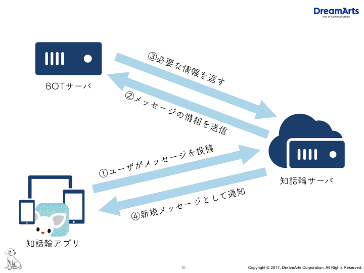

# 知話輪APIを利用する前の基礎知識

1. [【基礎知識の確認】知話輪APIとは？](#知話輪APIとは)
	- [WebAPIとは](#WebAPIとは)
	- [WebAPIの種類](#WebAPIの種類)
	- [WebHookの利用](#WebHookの利用)
	- [WebHookのメッセージ投稿イベント](#WebHookのメッセージ投稿イベント)
	- [WebAPI / WebHook / BOTの利用イメージ](#利用イメージ)
	- [Herokuに関する補足](#Heroku)

  

 

> <h4>環境構築のその前に…

## 1. 【基礎知識の確認】知話輪APIとは？  

 

[知話輪API公式サイト](https://developers.chiwawa.one/api/index.html)

 

---  

### WebAPIとは

webAPIは、<strong> 知話輪の外 </strong>からデータ・機能へアクセスすることができるしくみです。
 

(具体的には、ユーザ情報・グループ情報やメッセージ内容などを指します。)

 
知話輪アプリでは、多岐にわたるWebAPIを用いて知話輪アプリの利用の幅を大きく広げることができます。
詳細は、[知話輪APIドキュメント](https://developers.chiwawa.one/api/document.html)から見ることができます。 

>利用例： INSUITEに登録したスケジュールをもとに、会議の時間を知話輪で通知できるようにする。

 

### WebAPIの種類

- メッセージ投稿
- メッセージ一覧取得
- メッセージ情報取得
- メッセージ削除
- メッセージ付加情報変更
- ファイル投稿
- グループ所属ユーザ覧取得
- グループ一覧取得

 
基本的なメッセージ投稿APIだけでも、以下のように活用することができます。

* メッセージ本文の指定

* メンション(通知先)の指定

>利用例：トラブルが発生したら、全員にPUSH通知付きでメッセージを投稿

* メッセージ投稿者の指定

>利用例：営業レポートが登録されたら、登録者の名前でグループにメッセージで報告

* Attachmentsの指定

>利用例：大量のデータを表の形式に変換し、メッセージとして投稿

 

---

### WebHookの利用

WebHook (うぇぶふっく) は、<strong> 知話輪の中 </strong>からデータ・
機能へアクセスすることができるしくみです。 
また、メッセージが投稿されたことを<strong> 知話輪の外 </strong>にリアルタイムで通知し、内容を<strong>WebAPI </strong>に届けます。

 

 >利用例：呼びかけると返事をしてくれる"あいさつBOT"の作成。

  

### WebHookのメッセージの投稿イベント

+ メッセージ本文
+ メッセージの持つID
+ 投稿されたグループの持つID
+ 投稿したユーザの持つID・名前

  

---

### WebAPI / WebHooks / BOTの利用イメージ

知話輪APIを使ってBOTを動かそうとすると、知話輪アプリ・知話輪サーバ・BOTサーバの三か所の間を行き来してデータをやり取りする形になります。実際に環境構築するためには、[WebAPI](#WebAPI)、および[WebHook](#WebHook)がどこでどのように動いているのかを理解しなければなりません。  

 

以下は、WebAPI / WebHooks / BOT の相関関係の概形です。

 

  

1. 一番初めにBOTを動かすきっかけとして、ユーザが知話輪アプリ上にメッセージを投稿します。
> 「今日の予定を教えて」

2. 知話輪サーバは、投稿されたメッセージを受け取り、その内容や情報をBOTサーバに渡します。
> テキスト内容→「今日の予定を教えて」 
 　投稿ユーザ→　知話輪 太郎 
 　　投稿日時→　2017年7月28日金曜日 AM9:20 
　　　　　　　　　⋮

 

3. BOTサーバは、受け取った情報からユーザに返すべき情報を判断し、サーバに返答するように言います。
> テキスト内容の「今日」「予定」「教えて」というワードから、ユーザが今日の予定を求めていることを判断。

 

投稿者・投稿日時などをもとに、『知話輪 太郎の2017年7月28日金曜日の予定』を返すよう、知話輪サーバに指令を出します。

4. 知話輪サーバは、BOTサーバの指令を受けて必要なデータを持ち出し、知話輪アプリに新規メッセージの形で返答を投稿します。
> 「知話輪 太郎 さんの 2017年7月28日金曜日 の予定は、(…)です。」

  

以下の図を見てください。 上記の概形において、WebAPI、およびWebHookが実際にどこでどう動いているのか確認できます。

 

 

 

1. ユーザが知話輪アプリ上にメッセージを投稿します。
2. メッセージ投稿を起因に、発言内容に左右されずメッセージ情報をBOTサーバに送信するのはWebHookの仕事です。実装するときは、知話輪アプリ内においてBOT用のアカウントにWebHookの宛先(ここではBOTサーバの場所)を設定します。
> ユーザの発言が「今日の予定を教えて」でも「えびふらい」などの意味を持たない内容でも動作は変わりません。

3. 上の例において、BOTサーバ内で実際に仕事をしているのはNode.js (のーど・じぇいえす) という言語で書かれたプログラムです。このプログラムを書く際に必要なパーツとなるのが、知話輪APIです。この例では、プログラムを置いておくBOTサーバはHeroku (へろく) に設定しています。HerokuはPaaS ( Platform as a Service ) と呼ばれるサービスで、BOTアプリケーションを実行するためのプラットフォームの役割を果たします。かんたんな詳細を[以下](#Heroku)に記述しておきます。

4. 知話輪サーバは、BOTサーバから届いた指令により知話輪サーバ内にしまわれている必要なデータを持ち出します。そして、知話輪アプリに新規メッセージの形で投稿します。
> ここでWebHookは登場しません。

 
