# ノンプログラミングで知話輪と外部Webサービスとを連携する
このドキュメントでは、<B>ノンプログラミングで知話輪と外部のWebサービスを連携</B>する方法を紹介します。
開発は一切不要で、慣れると3分程度で自分の作業を自動化してくれるようなボットを作成できます。

## 背景
最近流行りのチャットボット。消費者向けの市場だけでなく、社内業務でも多くの活用事例が出てきました。

かつては、このようなボットを作ろうとすると、プログラミングスキルが必須でしたが、今では時代が変わって、さまざまなことがプログラミングなしで実現できるようになってきました。

今回紹介するzapierというサービスを使うと、ブラウザでポチポチ設定するだけで、google docs, Excel, trello, github, zendesk, salesforce, twilioなど750以上の便利なサービスと知話輪を簡単に連携できます。

以下では、zapierを用いて、知話輪と外部の便利なサービスとを接続する方法を紹介します。

## 手順
1. 【知話輪管理画面】APIトークンを発行する
1. 【zapier】zapierにログインし、zapを作成する
1. 【zapier】知話輪とzapierをつなげる
1. 【zapier】zapierとgoogle spread sheetをつなげる
1. 【知話輪】動作確認

## 準備するもの
1. 知話輪のアプリ、ユーザアカウント、Bot管理権限
1. zapierアカウント
1. Chromeブラウザ

（※知話輪アプリ、ブラウザ、ログインユーザを準備するだけで、開発環境の構築は不要です。）

## 【知話輪管理画面】APIトークンを発行する
- 知話輪管理画面にアクセスし、下記の手順でAPIトークンを発行します。
 
1. https://[YOUR_COMPANY_ID].chiwawa.one/admin/login　からログイン。
1. 「カスタマイズ＞Bot管理（トークン発行）＞新しく作成する」を選択。
1. ボット名称は「ZapierTestBot」としておく。
1. ダイレクトメッセージを利用「する」を選択し、「登録する」ボタンを押す。
1. APIトークンを後にzapierにセットするためコピー。

## 【zapier】zapierにログインし、zapの作成を開始する
1. zapierにログイン。
    - https://zapier.com
1. 下記の招待URLをクリックし、「accept invite」をクリック。zapの編集画面に進む。
    - https://zapier.com/developer/invite/72458/7a69dd70c9edd9527de9e83ca1ce03d1/
    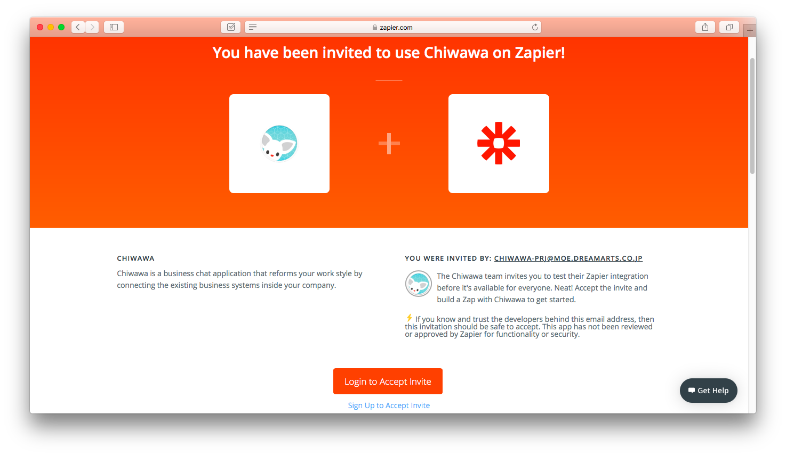 

## 【zapier】知話輪とzapierをつなげる
ここでは知話輪に新規メッセージが投稿されたことをトリガーとして処理が動くように設定をします。そのために、知話輪への接続情報等の設定を行います。

1. 左メニューの「TRIGGER＞1. Set up this step＞Choose App」にて、Chiwawaを検索する。 
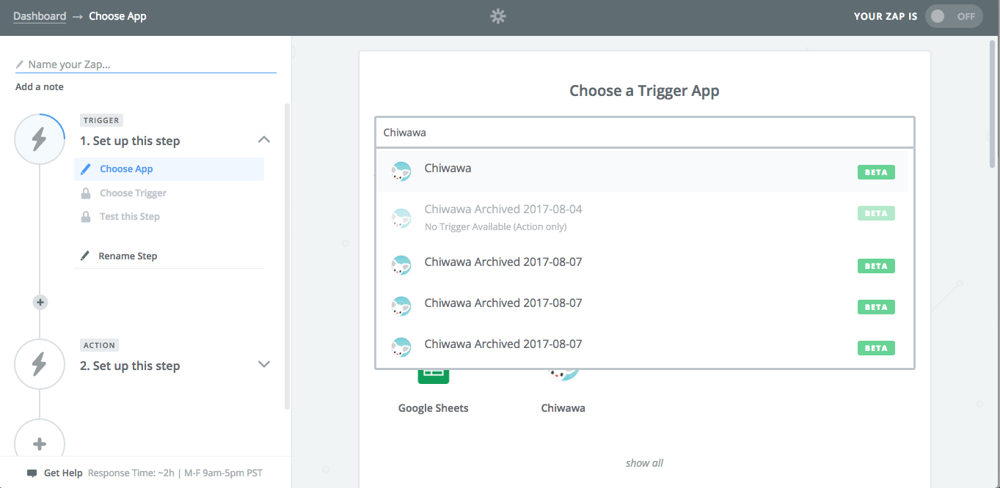 
1. 「New Message」を選択し、「Save + Continue」をクリック。 
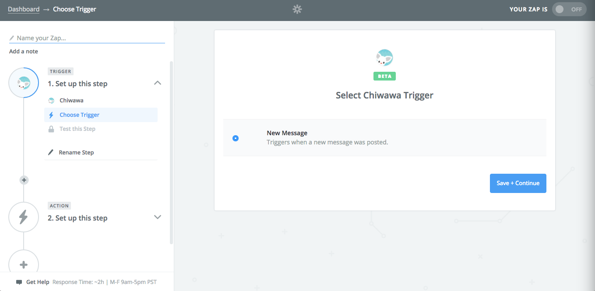 
1. 「Connect an Account」を選択し、知話輪管理画面で発行したAPI Keyと、知話輪のCompany IDを入力する。
    - ブラウザによって、ポップアップがブロックされたら、ブロックを解除する。 
    - 入力し終わっても選択肢が出てこず、Continueボタンが押せない場合は、ブラウザのリフレッシュボタンを押す。 
  
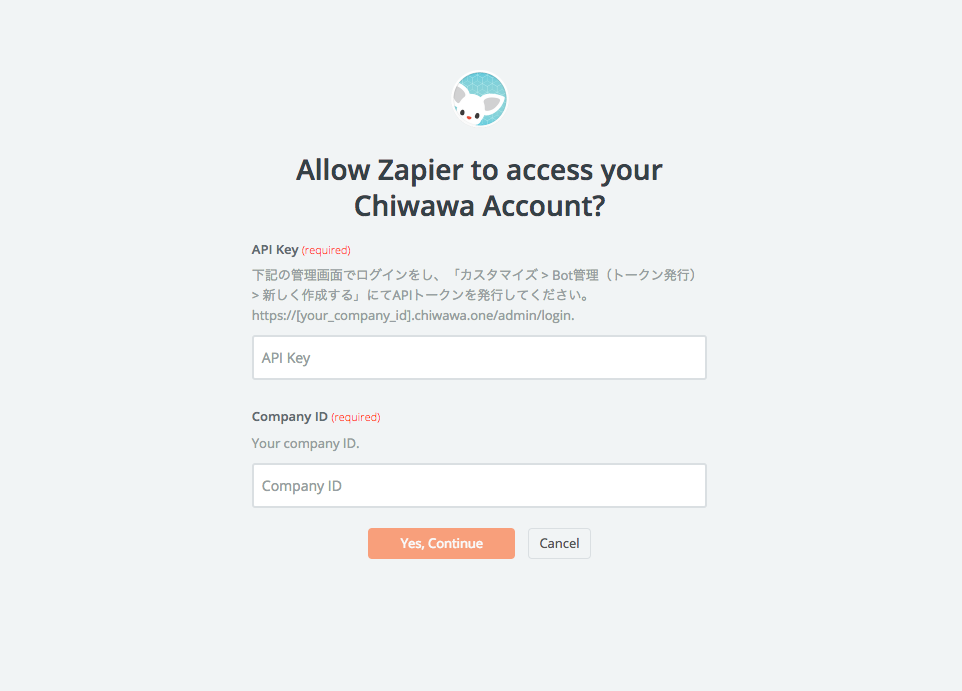 
1. 知話輪の企業IDを入力する。 
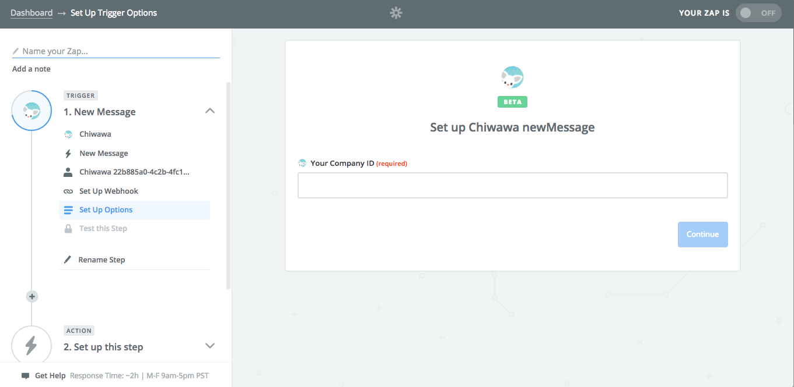 
1. 下記画面にて発行されたURLをコピーする。 
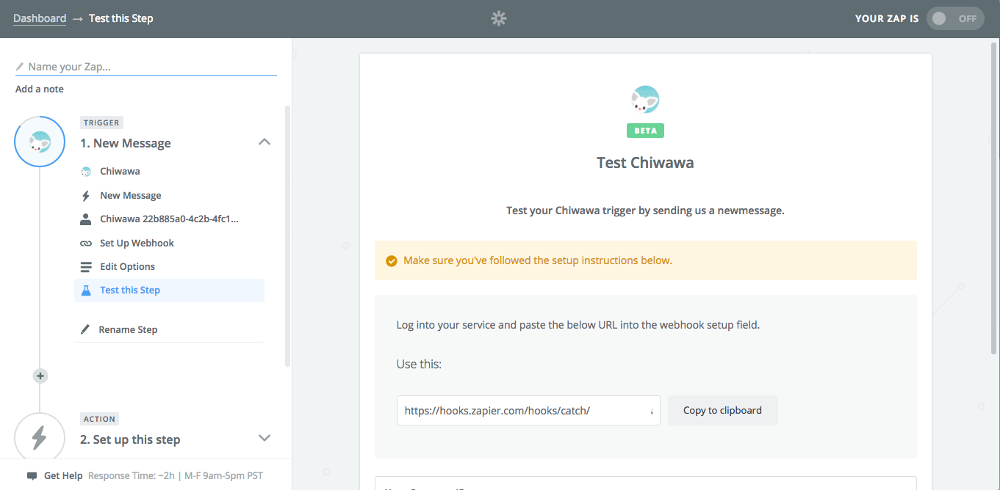 
1. 知話輪のBOT管理画面のWebhook URLの欄に貼り付ける。
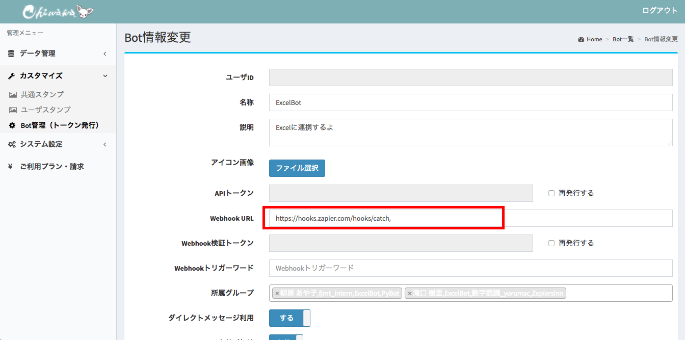 
1. 「OK, I did this」を選択し、知話輪アプリからテストメッセージを投稿する。（知話輪アプリの左メニューのグループ・個人の追加画面から、ZapierTestBotを追加し、適当なメッセージを投稿すると、テストが完了する。）
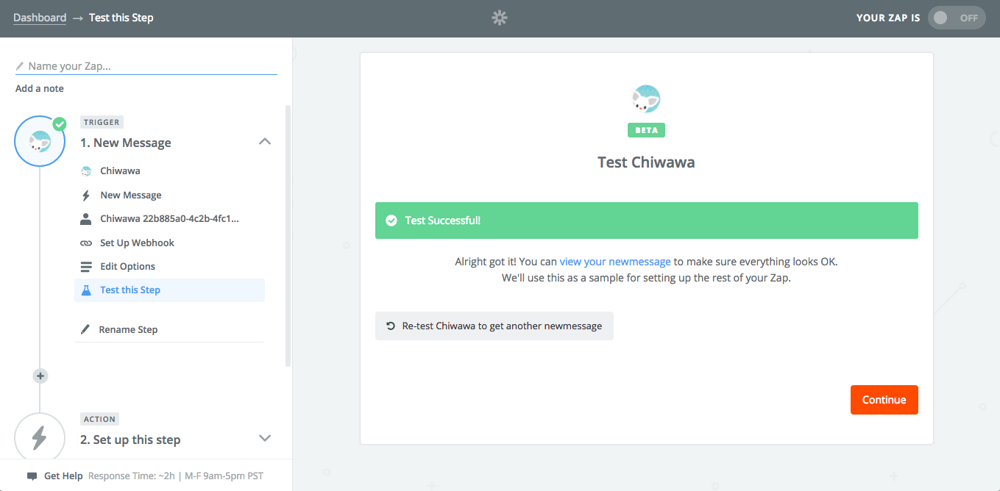 
1. 「Test Successful!」と表示されたら、Continueボタンを押す。

以上で知話輪とzapierをつなげる設定は完了です。もし、テストが成功しない場合は、上記の設定を再確認をした上で、知話輪のアプリから自分のボットに対して再度テストメッセージを投稿してください。

## 【zapier】zapierとgoogle spread sheetをつなげる
ここまでで、知話輪にメッセージが投稿されたら何かをするというトリガーの設定が完了しました。ここからは、トリガーが作動した際に、google spread sheetにメッセージを記入するという設定を行います。（以下、トリガーが発動した際に動く処理のことをACTIONと呼びます。）

1. 「ACTION＞2.Set up this step＞Choose App」の画面にて、Google Sheetsを選択する。
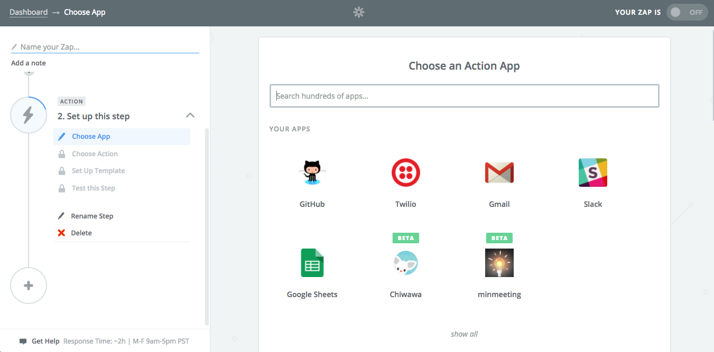 
1. 「Create Spreadsheet Row」を選択し、「Save + Continue」ボタンを押す。
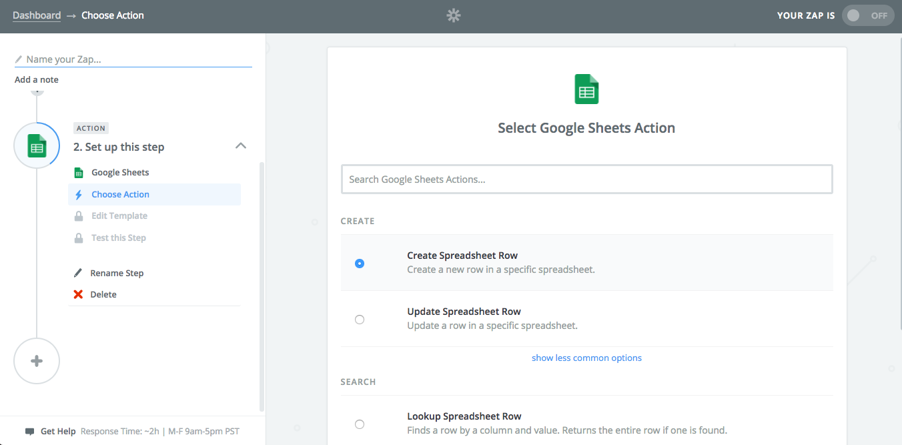 
1. 「Connect an Account」を押し、ポップアップで表示される画面にて、GoogleのログインとSheetsへのアクセス許可の設定を行う。 
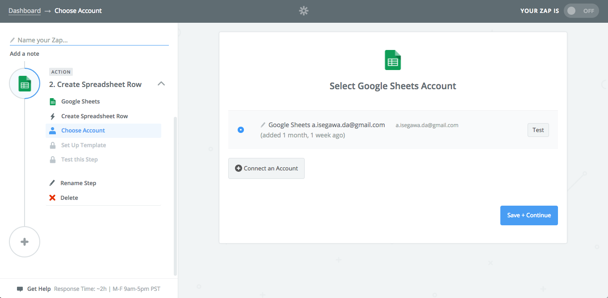 
1. ブラウザで別のタブを起動し、連携用のgoogle spread sheetを作成する。 
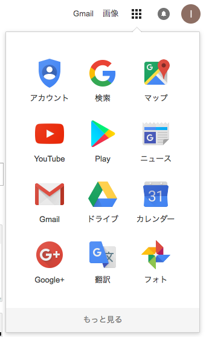 
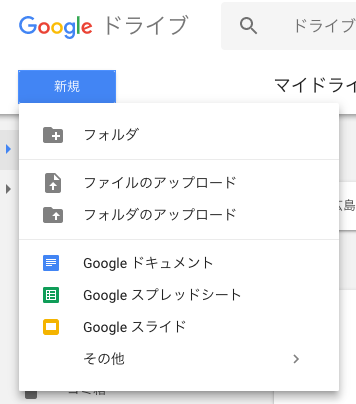 
1. google spread sheetのヘッダー（1行目）に適当なタイトルを入力しておく。 
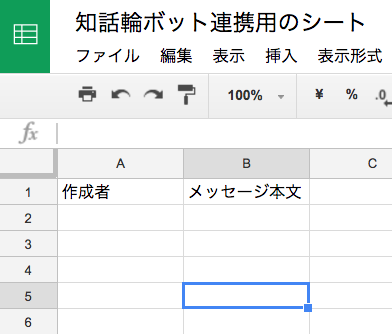 
1. zapierの画面に戻り、Spreadsheet、Worksheetを選択する。 
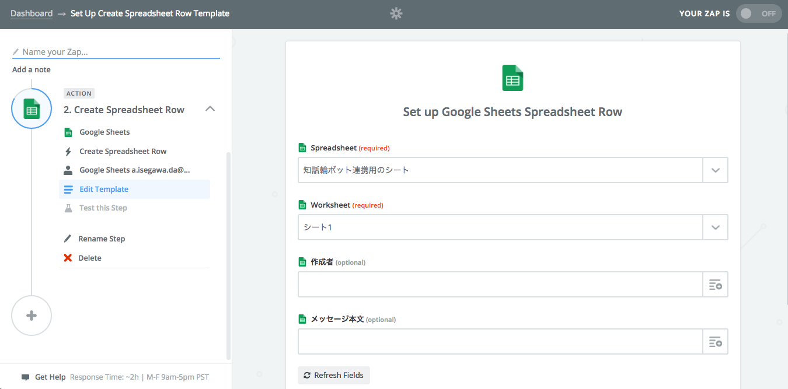 
1. Worksheetまで選択が完了すると、シートのヘッダー（1行目）のタイトルが入力欄として表示される。
    - 表示されない場合は、「Refresh Fields」を押す。
    - 入力欄右側のアイコンをクリックすると、知話輪から連携されたデータ項目が選択できる。
    - 作成者の入力欄に知話輪の「メッセージ作成者ユーザ名」をセットする。
    - メッセージ本文の欄に知話輪の「メッセージ本文」をセットする。 
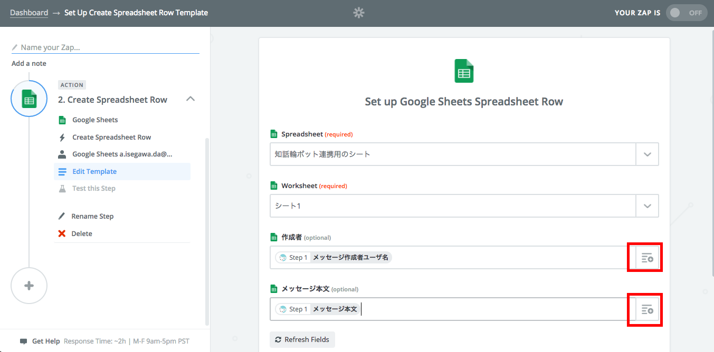 
1. テストを実施し、「Create & Continue」を押す。
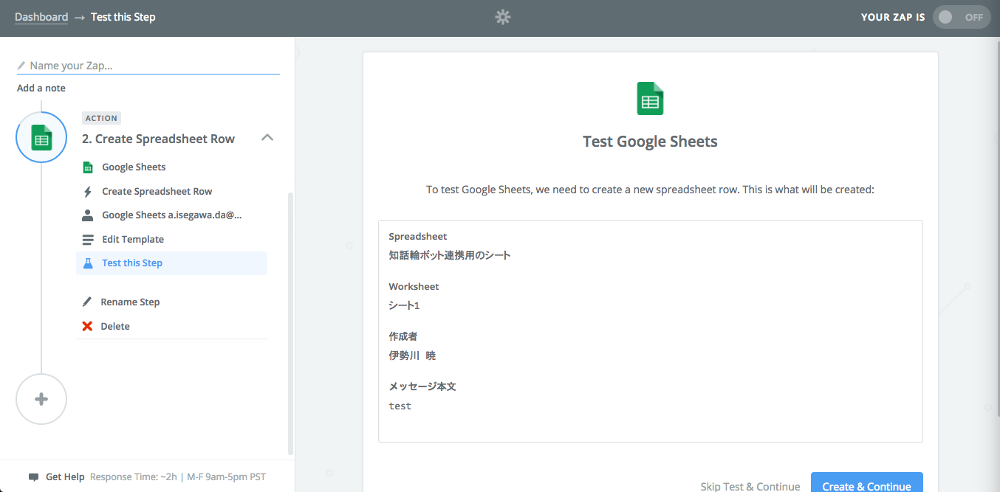 
1. 「Test Successful!」と出たら、「Finish」ボタンを押す。
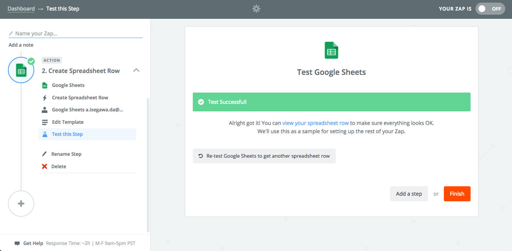 
1. 設定が完了し、下記のような画面が出てきたら「YOUR ZAP IS OFF」になっている部分を「ON」に変える。
    - もし設定に不足がある場合は、上記の画面の前に不足内容が表示されるため、不足内容を確認して、再度設定を行う。 
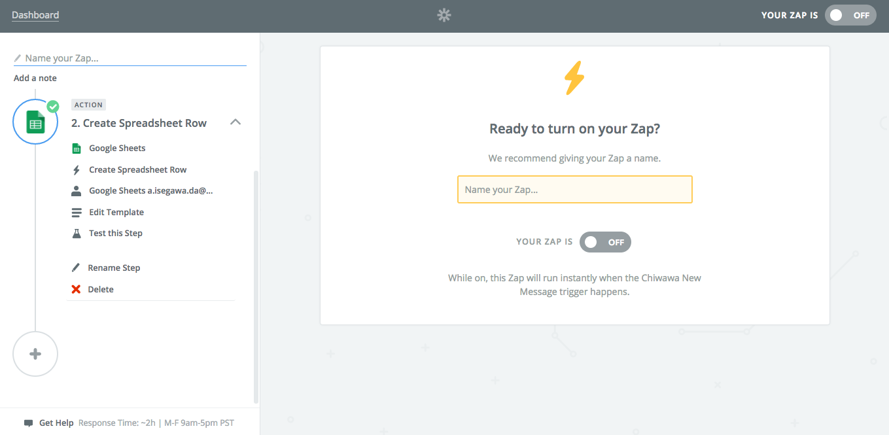 

以上で設定は完了です。

## 【知話輪】動作確認
設定が完了したら、動作確認をしてみましょう。

1. 左メニューから自分が作成したボットを追加する。 
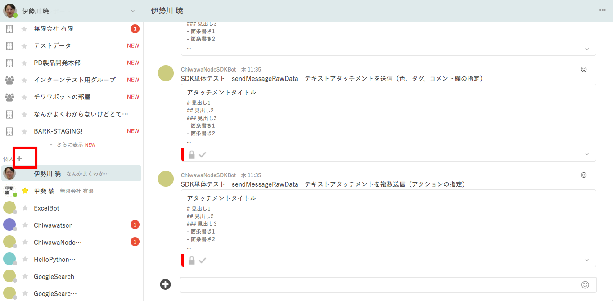 
1. 自分が作成したボットをクリックし、「選択」ボタンを押す。 
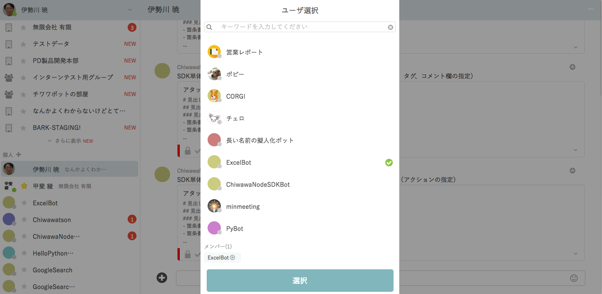 
1. 動作確認用のメッセージを投稿する。 
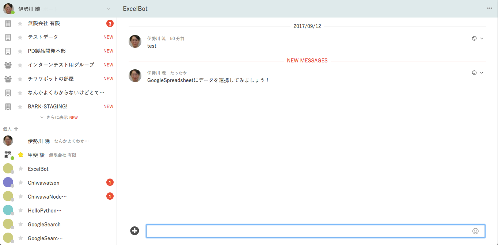 
1. spreadsheetにデータが連携されていることを確認する。 
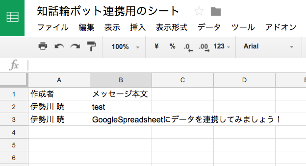 

## 知話輪とzapierを用いたボットの例
ここまでの手順を実施すると、一行のコードも書かずに、知話輪ボットが非常に簡単に作成できることが体験できたと思います。では、これを応用すると他にどのようなことができるのか、いくつかの例を紹介します。

| サービス概要 | サービス名 | 知話輪連携の例 |
|---|---|---|
| 表計算 | Excel, Google Spreadsheets | 知話輪の投稿内容を一覧表化。Excelに記入されたら知話輪に通知。 |
| アンケート、入力フォーム | Google Forms | アンケートの回答があったら知話輪に通知。 |
| メール | Gmail | Googleアラートのメールが届いたら知話輪のチームで共有。 |
| お問い合わせ管理 | Zendesk | お問い合わせのチケットが発行されたら知話輪の担当部署に通知。 |
| マーケティング・SFA | Salesforce | 新規リード獲得時に知話輪の担当部署に通知。 |
| 名刺管理 | Sansan | 名刺が登録されたら知話輪のチームで共有。 |
| CMS | Wordpress | コメントがついたら知話輪のチームで共有。 |
| Todo管理 | Trello | 新規のカードが追加されたら知話輪で共有。知話輪のメッセージをTodo化。 |
| github | ソース・課題管理 | 新規のissueが登録されたら知話輪の担当チームに連絡。 |
| CI | jenkins | テストが失敗したら知話輪に通知。 |
| ノート | Evernote | 知話輪のメッセージをノート化。 |
| ファイルストレージ | Google Drive, One Drive, Drop Box | 新しいファイルが追加されたら知話輪に通知。 |
| 定時イベント | Zapier Sceduler | 毎日、毎週など定期的に処理を実行。毎朝メールの検索結果を知話輪に通知するなど。 |
| カスタマイズ | Zapier Code | JavascriptやPythonのコードを実行してカスタムの処理を記載。上記で不足している点を補う際に用いることができる。（※1） |

（※1　JavascriptやPythonを用いる場合は、zapierではなく、別の手順で紹介しているAzureを用いる方が安く、拡張性も高く、しかも簡単に実現できます。具体的なやり方は次のステップを参照してください。）

## 次のステップ
- [知話輪ボット入門　Javascript＋Azure Functions編](./CreateBotWithJavascriptOnAzureFunctions.md)
- [知話輪ボット入門　Python＋Azure Functions編](./CreateBotWithPythonOnAzureFunctions.md)

## その他参考資料
- [知話輪とは](https://www.chiwawa.one/)
- [zapierとは](https://zapier.com)
