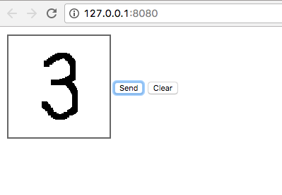

# TensorFlowを用いたAIチャットボット入門（Mac編）
これまでのチュートリアルでは、IBMのWatsonやMicrosoftのQnAMakerなどを用いて、ほとんどプログラミングをせずにAIチャットボットを作成してきました。<br />
しかし、それらはQAなどの限定された用途で使えるだけで、自分でモデルを定義して独自の学習をさせることはできませんでした。<br />
そこで、今回は人気のDeepLearningのフレームワークであるTensorFlowを用いて、知話輪のAIチャットボットを作る方法を紹介します。<br />

## はじめる前に
本格的な機械学習とボット開発の入り口となるため、本稿から複雑度と難易度があがります。もし、プログラミングやチャットボットに不案内な場合は、まず下記をご参照ください。
- [プログラミング不要! 知話輪と外部のWebサービスを連携する](./ConnectChiwawaWithWebServices.md)
- [APIを使うための基礎知識](./APIComponent.md)

もし、Pythonによるチャットボットの開発経験がない場合は、下記の記事が参考になります。
- [知話輪ボット入門　Python＋Azure Functions編](./CreateBotWithPythonOnAzureFunctions.md)

もし、本格的な機械学習を始める前に、AIを使ってみたい場合は、下記の記事をご参照ください。
- [Microsoft QnAMakerを使って、コピペだけでAIチャットボットを作る](./CreateQABotWithAzureAndQAMaker.md)
- [IBM Watson Conversationを使って、コピペだけでAIチャットボットを作る](./CreateWatsonBotWithJavascriptOnAzureFunctions.md)

## 全体の流れ
- python環境の構築
- サンプルコードのダウンロードと実行
- ソースコードの理解
  - 学習データのダウンロード
  - 学習のさせ方
  - 学習結果の保存の仕方
  - 保存した結果を使って、予測をさせる
  - チャットボットの問い合わせに応じて予測結果を返す
- 参考資料

## 準備するもの
1. 知話輪のアプリ、ユーザアカウント、Bot管理権限
1. python3、pip3が実行できる環境
1. Google Cloud Platformのアカウント（無料トライアル可）
1. gitコマンドが実行できる環境

（※開発環境の構築をシンプルにするため、ここではMacの手順を記載します。）

## python環境の構築（Terminalにて）
- homebrewのインストール。homebrewとは、Macでのソフトウェアのインストールを簡単にするパッケージ管理システムのこと。
```
/usr/bin/ruby -e "$(curl -fsSL https://raw.githubusercontent.com/Homebrew/install/master/install)"
```
- python3のインストール。
```
brew install python3
```
- virtualenvのインストール。virtualenvは、pythonの仮想環境を作るソフトウェア。
```
pip3 install virtualenv
```

## サンプルコードのダウンロードと実行
全体の動きを理解するため、サンプルコードをダウンロードして実行してみましょう。サンプルコードは、ブラウザにて手描きで0〜9の数字を記入すると、知話輪に数字の認識結果が投稿されるというものです。詳細は後に説明をするため、まずは中身は気にせず動かしてみましょう。

- ソースコードをクローン（Terminalにて）。
```
git clone https://github.com/DreamArtsChiwawa/APIGuides.git
```
- ソースコードの場所に移動。
```
cd APIGuides/samples
```
- Macのデフォルトがpython2なので、python3の仮想環境をつくる。
```
virtualenv --python=/usr/local/bin/python3 helloPythonBotWithTensorFlow
cd helloPythonBotWithTensorFlow/
source bin/activate
```
- pythonのバージョンが3系になったことを確認する。Python 3.X.Xと出れば3系。
```
python -V
```
- 依存するライブラリ等をインストールする。
```
pip install -r requirements.txt
```
- mnistのデータを使って手描きの数字認識の機械学習を実行する。内容は後述。
```
python train.py
```
- 「StartLocalServer.sh」をテキスト・エディターなどで開き、企業ID、グループID、APIトークンをセットする。
```
export CHIWAWA_API_TOKEN='APIトークンをセットしてください。'
export COMPANY_ID='企業IDをセットしてください。'
export GROUP_ID='グループIDをセットしてください。'
```
- PC上でサーバーを起動。
```
./StartLocalServer.sh
```
- ブラウザで下記のURLにアクセス。
    - http://127.0.0.1:8080/
- ブラウザに表示された四角の中に数字を入力して「Send」ボタンを押す。<br />
<br />
- 正しく設定がされていれば、指定したグループに予測結果が投稿される。<br />
<br />


## ソースコードの理解
動きを確認したら、ソースコードを見ながら要点を確認していきましょう。

### 学習データのダウンロード（train.py）
行列計算にするとコードがシンプルになるため、Neural Networkを使う場合は、データを(多次元)配列に整形して放り込みます。今回は簡単にするため、インターネットに公開されているデータ（mnist）をつかって学習を行います。
このmnistのデータの中には、28×28ピクセルの手書き文字の画像データ（実際は0と1の2次元配列）と、それが何の数字かという正解データが入っています。正解データには正解の数字が入っている訳ではなく、要素数10の配列が入っています。配列の要素のうち正解のところだけに1が入っており、それ以外は0が入った形になっています。（これをone-hotベクトルと呼びます。）
```
from tensorflow.examples.tutorials.mnist import input_data
  :
# 学習データを取得する。引数にはデータの保存先と、one-hotベクトルの指定を行う。（Falseにしても結局one-hotベクトルの形）
mnist = input_data.read_data_sets('/tmp/tensorflow/mnist/input_data', one_hot=True)
```

### 学習のさせ方（train.py）
教師あり学習の基本は、モデルと教師データの誤差を最小化することです。では、モデルをどのように書いて、誤差をどのように評価し、それをどうやって最小化するのかを見ていきましょう。

1. モデルを用意する
    - ここでは一層のニューロンを準備します。xが入力値で、W（Weight）は入力信号の重み付けのパラメーター、b（bias）はニューロンの活性のしやすさを調整するパラメーターです。それらをかけ合わせた出力結果がyとなります。
```
x = tf.placeholder(tf.float32, [None, 784])
W = tf.Variable(tf.zeros([784, 10]))
b = tf.Variable(tf.zeros([10]))
y = tf.matmul(x, W) + b
```
2. モデルに渡すパラメータの良し悪しを判断する誤差関数を用意する
    - モデルと教師データとの誤差を評価するため、クロスエントロピーを計算する関数を準備します。
```
cross_entropy = tf.reduce_mean(
    tf.nn.softmax_cross_entropy_with_logits(labels=y_, logits=y))
```
3. 誤差を最小にするようにパラメータの値を最適化する
    - 勾配降下法にて、クロスエントロピー誤差を最小化するよう、上記のWeightとbiasのパラメーターが自動的に調整されます。
```
train_step = tf.train.GradientDescentOptimizer(0.5).minimize(cross_entropy)
sess = tf.Session()
tf.global_variables_initializer().run()
for _ in range(1000):
  batch_xs, batch_ys = mnist.train.next_batch(100)
  sess.run(train_step, feed_dict={x: batch_xs, y_: batch_ys})
```

## 学習結果の保存の仕方（train.py）
学習には時間がかかることが多いため、チャットボットのようにすぐに応答してほしい場合は、毎回学習することはできません。そこで、一度学習させておいたデータを保存しておいて、それを使って予測をします。学習済みの状態を保存する方法は下記の通りです。
```
savedFileName = 'checkpoint/saved_file_1'
saver = tf.train.Saver();
saver.save(sess, savedFileName)
```

## 保存した結果を使って、予測をさせる（recognize.py）
上記で保存した状態を復元して、予測を実施する方法は下記の通りです。
```
with tf.Session() as sess:
  sess.run(tf.global_variables_initializer())
  saver = tf.train.Saver()
  saver.restore(sess, savedFileName)
  sess.run(...)
```

## チャットボットの問い合わせに応じて予測結果を返す
- 予測する側（recognize.py）
    - 前述の方法で学習結果を復元し、predict関数でデータを受け取って予測結果を返します。
```
# 保存した学習結果を復元する
sess = tf.Session()
sess.run(tf.global_variables_initializer())
saver = tf.train.Saver()
saver.restore(sess, savedFileName)

# 引数でimage（28×28の配列）を受け取る
def predict(image):
  # 予測を実施
  results = sess.run(y, feed_dict={x: [image]})
  # 予測結果は確率の配列で返ってくるため、一番確率が高い要素の番号を取得する
  predictedValue = np.argmax(results[0])
  # 予測結果を返す
  return predictedValue
```
- チャットボット側（main.py）
```
# 上記で定義したrecognize.pyをインポートする
import recognize
  :
# predict関数を呼びだす
result = recognize.predict(image)
```

以上で、TensorFlowを知話輪のチャットボットとつなげる方法が理解できたと思います。ぜひ、TensorFlowを使いこなして、より本格的なAIチャットボットの開発にチャンレジしてみてください。

## 参考資料
- [知話輪とは](https://www.chiwawa.one/)
- [知話輪のAPIドキュメント](https://developers.chiwawa.one/api/)
- [TensorFlow（英語）](https://www.tensorflow.org/)
- [MNIST For ML Beginners（英語）](https://www.tensorflow.org/get_started/mnist/beginners)
    - train.pyのコードはこのチュートリアルを元に、シンプルにして保存できるように変更を加えています。train.pyの部分をより詳しく知りたい場合は、このチュートリアルを参考にしてください。
- [TensorFlowで学ぶディープラーニング入門 ~畳み込みニューラルネットワーク徹底解説~](https://www.amazon.co.jp/TensorFlow%E3%81%A7%E5%AD%A6%E3%81%B6%E3%83%87%E3%82%A3%E3%83%BC%E3%83%97%E3%83%A9%E3%83%BC%E3%83%8B%E3%83%B3%E3%82%B0%E5%85%A5%E9%96%80-~%E7%95%B3%E3%81%BF%E8%BE%BC%E3%81%BF%E3%83%8B%E3%83%A5%E3%83%BC%E3%83%A9%E3%83%AB%E3%83%8D%E3%83%83%E3%83%88%E3%83%AF%E3%83%BC%E3%82%AF%E5%BE%B9%E5%BA%95%E8%A7%A3%E8%AA%AC~-%E4%B8%AD%E4%BA%95-%E6%82%A6%E5%8F%B8/dp/4839960887/ref=sr_1_sc_3?ie=UTF8&qid=1505364366&sr=8-3-spell&keywords=Tensoflow)
    - templates/index.htmlの手描きメモを28×28の0と1の二次元配列にしてサーバーに送りつける部分のコードは、この本を参考にしています。この本を読み進めれば、さらに認識精度を高めながら畳み込みニューラルネットワークが理解できます。