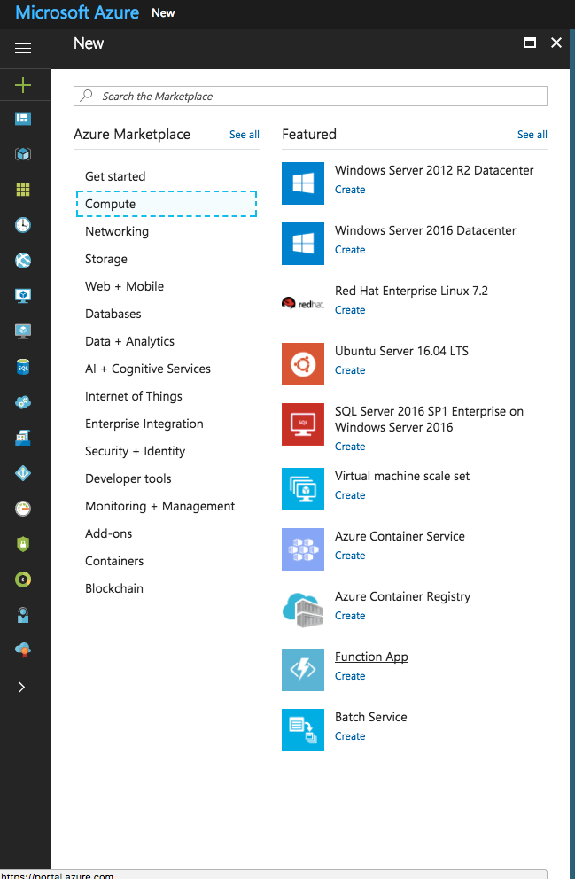
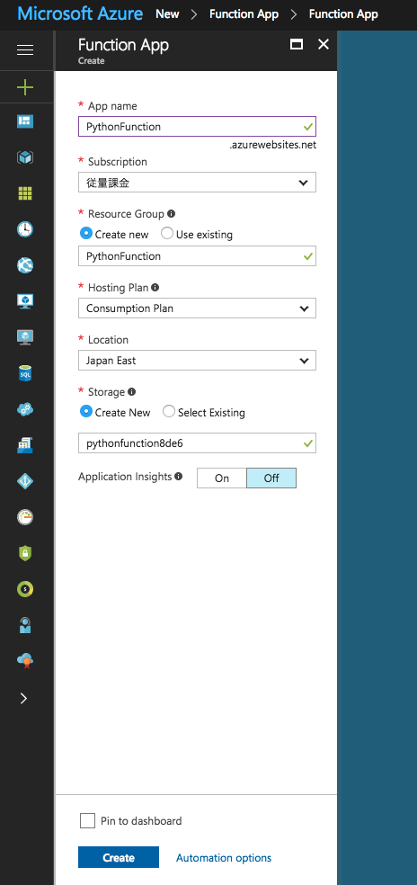
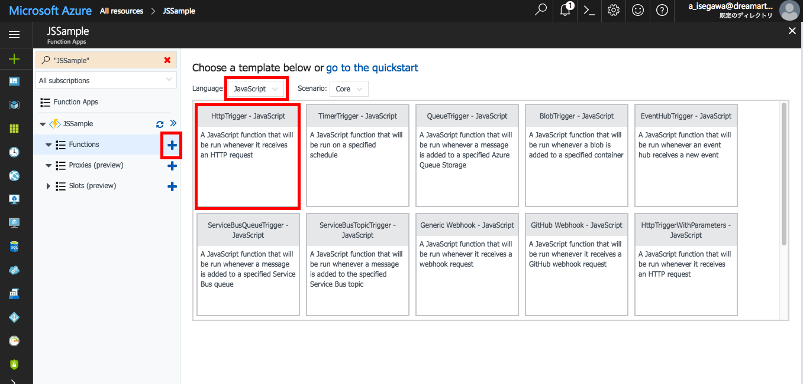
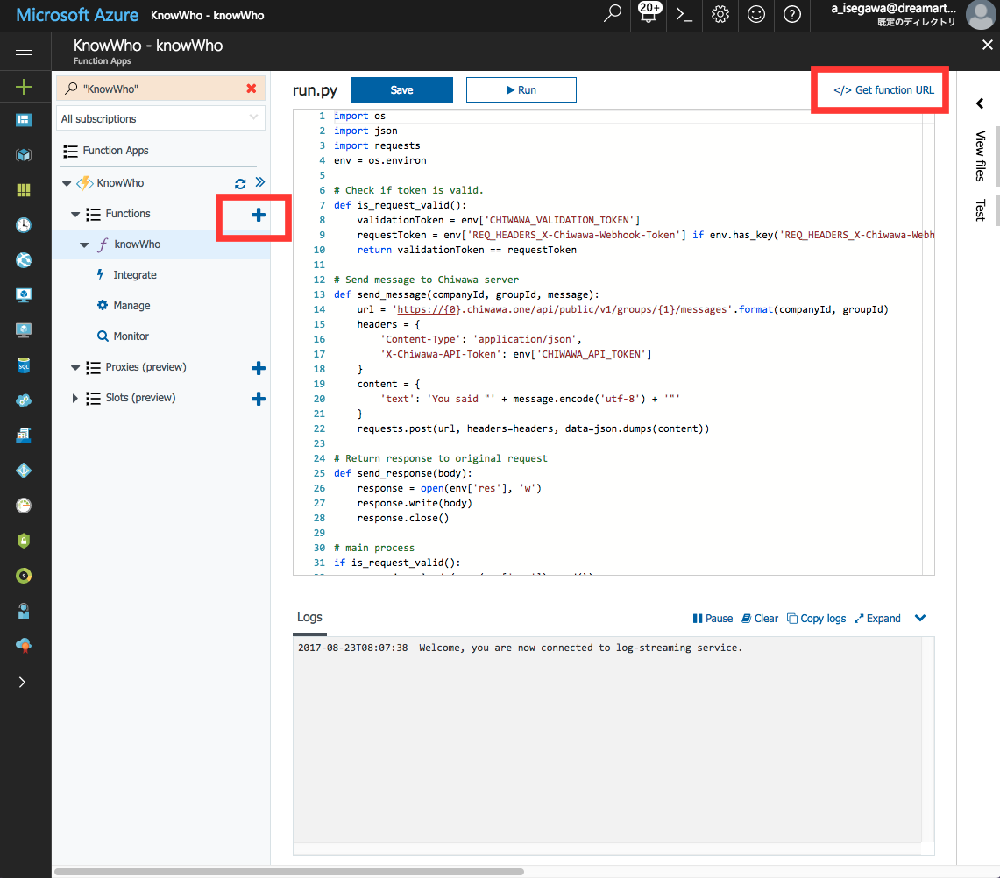
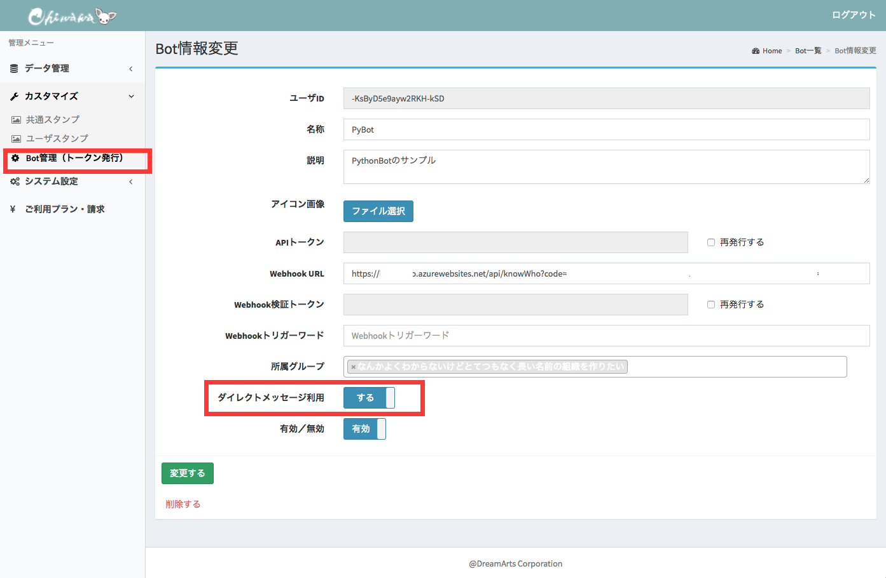
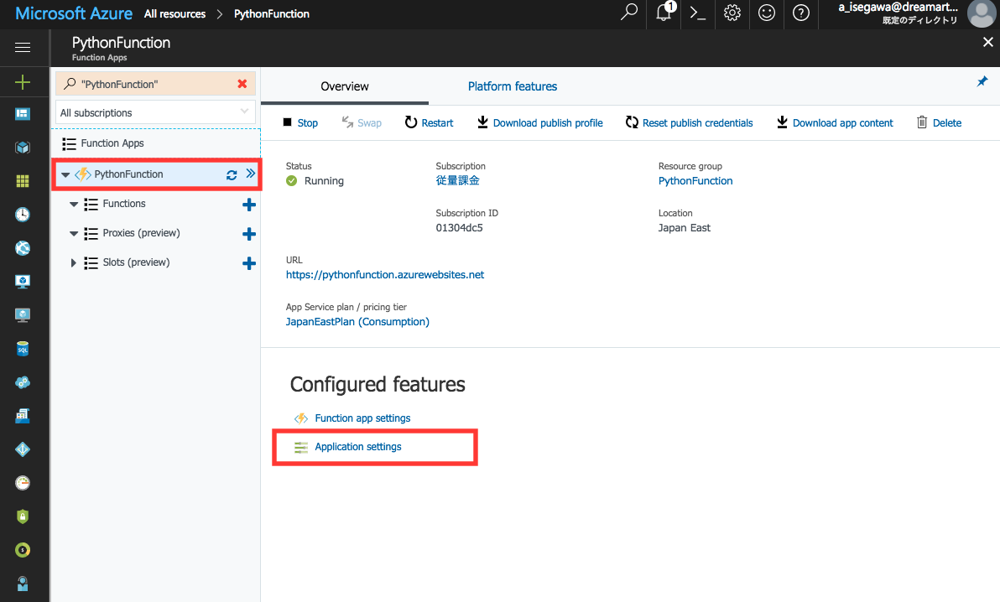
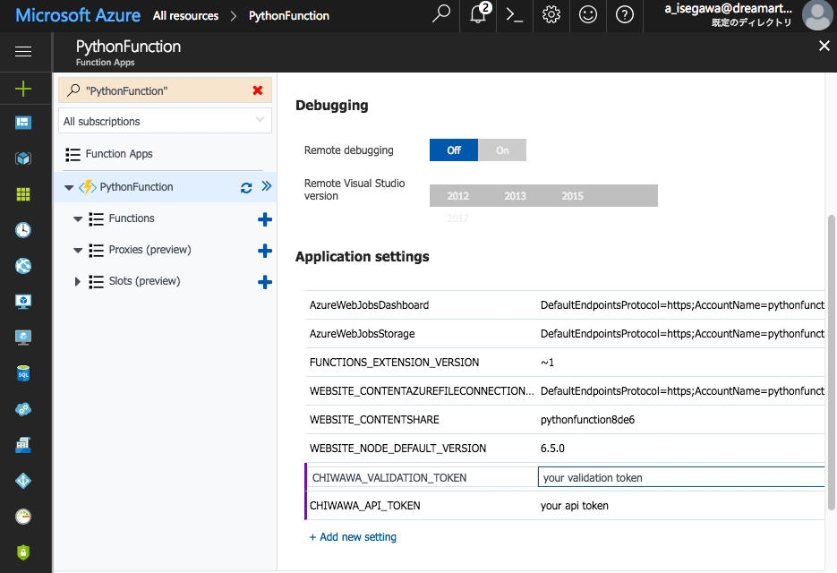
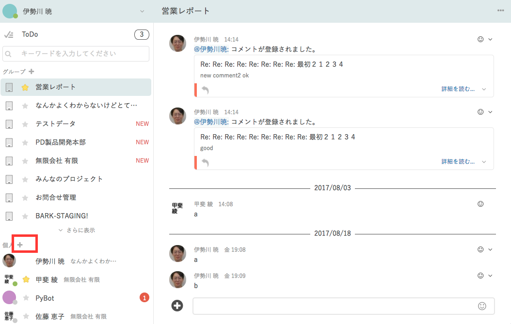
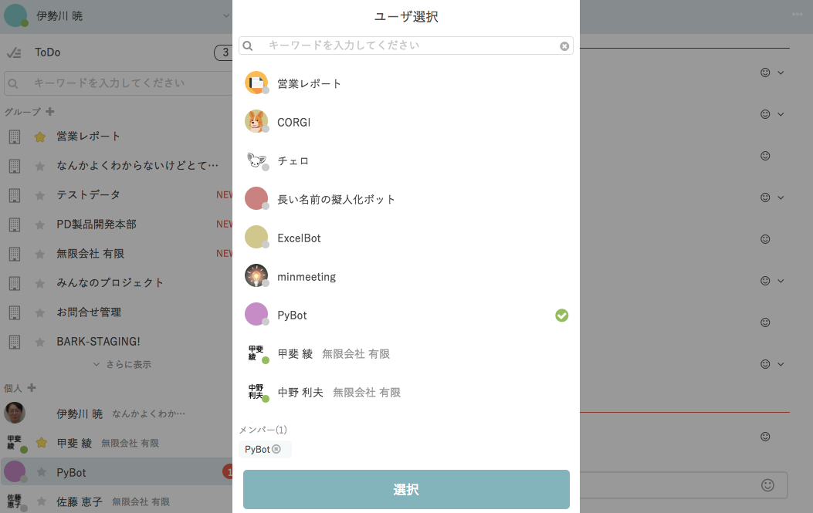
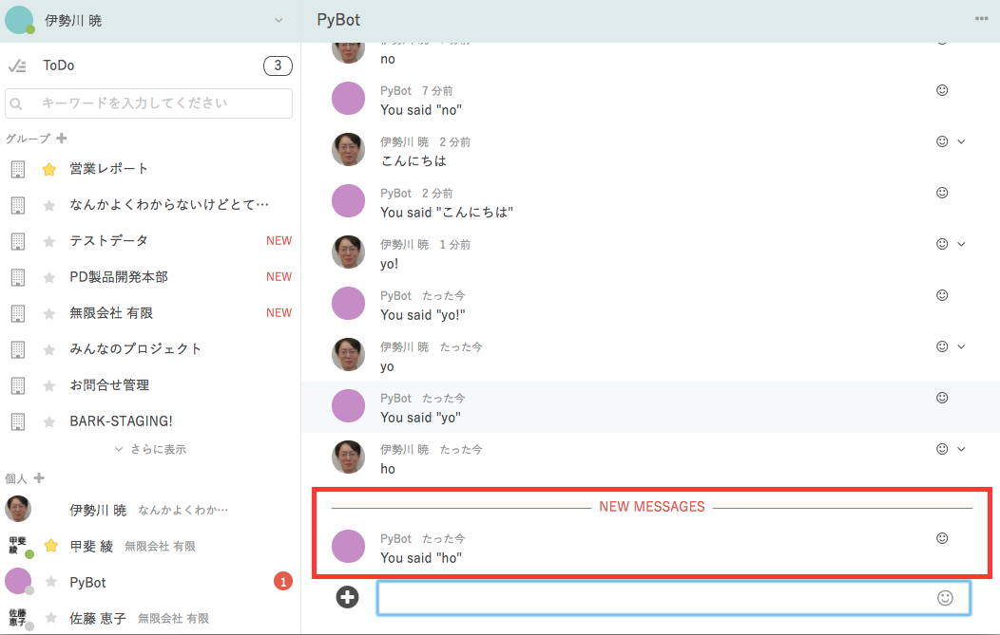

# 知話輪ボット作成手順　Javascript on Azure Functions編
Azure FunctionsのJavascriptを用いて、知話輪ボットを作成する手順を紹介します。
「こんにちは」と投稿すると、「こんにちは」と返すだけのシンプルなボットを実装することで、ボットの作り方を理解しましょう。
インフラ構築・開発環境の構築・プログラミングの深い知識は不要で、ブラウザ上でコピペをするだけで開発ができます。

作成手順は下記の通りです。
1. 【Azure】Functionsを作成する
1. 【知話輪管理画面】APIトークンを発行する
1. 【Azure】アプリケーション設定から、APIトークン等を環境変数に設定
1. 【Azure】サードパーティーのライブラリをインストール
1. 【Azure】コーディングをする
1. 【知話輪アプリ】アプリから動作確認をする

以下、詳細を説明します。

## 【Azure】Functionsを作成する
- Microsoft Azureにログインし、ダッシュボードを表示　https://portal.azure.com
- 左のプラスボタン＞Compute＞Function App＞createを選択<br />
<br />
- Functionの名称やリージョンを選択してcreate<br />
<br />
- functions右のプラスボタンからfunctionを作成し、javascriptのサンプルを選択
<br />
- 作成したfunctionを選択し、右上の「</> Get function URL」から、知話輪の管理画面に設定するためのWebhook URLを取得<br />
<br />

## 【知話輪管理画面】APIトークンを発行する
- 知話輪管理画面にアクセスし、下記の手順でAPIトークンを発行します。
<br />
1. https://[YOUR_COMPANY_ID].chiwawa.one/admin/login　からログイン
1. 「カスタマイズ＞Bot管理（トークン発行）＞新しく作成する」を選択
1. ボット名称は「AzureJsBot」としておく
1. Azure Functionsで発行されたURLをWebhook URLにセット
1. ダイレクトメッセージを利用「する」を選択し、「登録する」ボタンを押す
1. APIトークンとWebhook検証トークンを次章でAzure Functionsの環境変数にセットするためコピー

## 【Azure】アプリケーション設定から、APIトークン等を環境変数に設定
- functionsの概要画面を表示し、「Application settings」をクリック
<br />
- 知話輪のトークンを環境変数にセット
<br />

| 環境変数名 | 値 |
|---|---|
| CHIWAWA_API_TOKEN | 知話輪のAPIトークン |
| CHIWAWA_VALIDATION_TOKEN | 知話輪のWebhook検証用トークン |

## 【Azure】コーディングをする
以下は、知話輪にメッセージが投稿された際に、投稿された内容をそのまま知話輪にメッセージ投稿するもの。
下記のコードをAzure Functionsのindex.jsにコピーするだけでボットが完成する。

```.js
/** メイン処理 */
module.exports = function (context, req) {
    if (ChiwawaService.isValidRequest(req, context)) {
        let messageText = ChiwawaService.getMessage(req);
        ChiwawaService.sendMessage(ChiwawaService.getCompanyId(req), ChiwawaService.getGroupId(req), "You said '" + messageText + "'", (err, httpResponse, body) => {});
        context.res = {body: "OK"};
        context.done();
    }
};

/** 知話輪関連の処理 */
var request = require('request');
const ChiwawaService = {
    /** リクエストの内容をチェック。
     * @param req リクエストオブジェクト
     * @param context（任意） Azure functionsの場合は、contextをセットすると、問題があった際にエラーレスポンスを返し、contextを処理済みにする。
     * @return 問題がある場合はfalseを返す。。 
     */
    isValidRequest: function(req, context) {
        // headerをチェック
        if (!ChiwawaService.privateMethods.isAuthorized(req)) {
            if (context) {
                context.res = {
                    status: 401,
                    body: "Unauthorized request."
                };
                context.log("401: Unauthorized request.");
                context.done();
            }
            return false;
        }
        
        // bodyをチェック
        if (!ChiwawaService.privateMethods.isBodyValid(req)) {
            if (context) {
                context.res = {
                    status: 400,
                    body: "Request body is not valid. Please set a message in the request body."
                };
                context.log("400: Bad request.");
                context.done();
            }
            return false;
        }
        return true;
    },
    /** リクエストから企業IDを取得 */
    getCompanyId: function(req) {
        return req.body.companyId;
    },
    /** リクエストからグループIDを取得 */
    getGroupId: function(req) {
        return req.body.message.groupId;
    },
    /** リクエストからメッセージを取得 */
    getMessage: function(req) {
        return req.body.message.text;
    },
    /** 知話輪にメッセージを送信 */
    sendMessage: function(companyId, groupId, messageText, callback) {
        const baseUrl = `https://${companyId}.chiwawa.one/api/public/v1/groups/${groupId}/messages`;
        const content = {
            'text': messageText
        };
        const headers = {
            'Content-Type': 'application/json',
            'X-Chiwawa-API-Token': process.env["CHIWAWA_API_TOKEN"]
        };
        const options = {
            url: baseUrl,
            headers: headers,
            json: content
        }
        request.post(options, function(err, httpResponse, body){
            if (callback) callback(err, httpResponse, body);
        });
    },
    privateMethods: {
        isAuthorized: function(req) {
            return req.headers['x-chiwawa-webhook-token'] === process.env["CHIWAWA_VALIDATION_TOKEN"];
        },
        isBodyValid: function(req) {
            return req.body && req.body.type && req.body.message;
        },
    }
}
```

## 【知話輪アプリ】アプリから動作確認をする
- 左メニューのプラスボタンからボットユーザを追加する
<br />
- 自分が作成したボット（AzureJsBot）を選択する　（※自分が作成したbotが出てこない場合は、知話輪管理画面で、「ダイレクトメッセージ利用」を「する」になっていることを確認してください。）
<br />
- メッセージを投稿すると同じ内容を返してくる<br />
<br />

以上で、Azure Functionsを用いた知話輪ボットは完成です。

## 参考資料
- [知話輪とは](https://www.chiwawa.one/)
- [知話輪のAPIドキュメント](https://developers.chiwawa.one/api/)
- [Watson Conversationのチュートリアル（英語）](https://console.bluemix.net/docs/services/conversation/getting-started.html#gettingstarted)
- [Watson ConversationのAPIドキュメント（英語）](https://www.ibm.com/watson/developercloud/conversation/api/v1/?node#)
