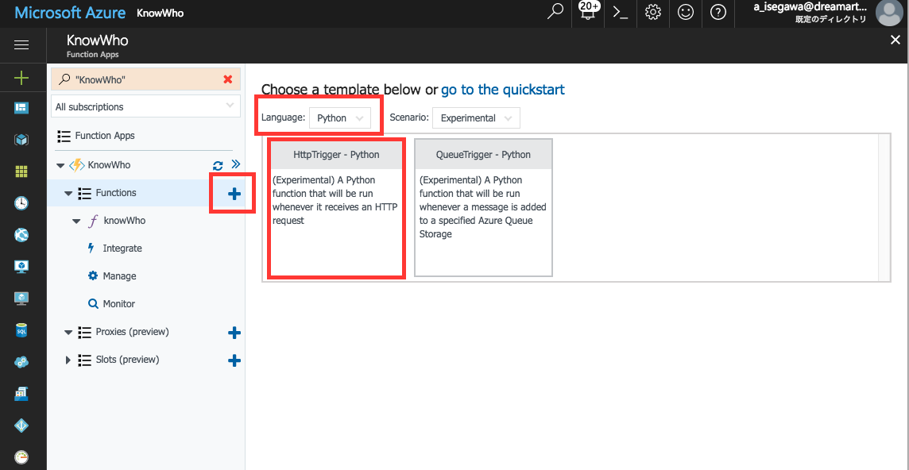
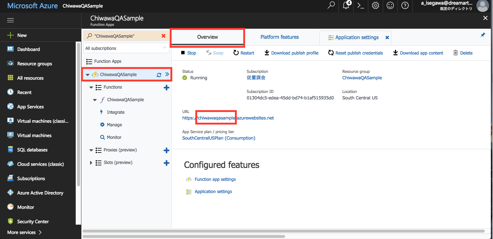

# 知話輪ボット作成手順　Python on Azure Functions編
Azure FunctionsのPythonを用いて、知話輪ボットを作成する手順を紹介します。

今回もボットサーバーは構築せず、Azure Functionsを使って、<B>ブラウザ上でコピペだけで開発</B>をします。<br />

## 準備するもの
1. 知話輪のアプリ、ユーザアカウント、Bot管理権限<BR>
<B>知話輪は下記サイトからお試しいただけます</B>。自社環境で本格的にセットアップして使い始める前に手軽に試したい場合などは、下記をご利用ください。<BR>
[プロダクト無料トライアル](https://www.dreamarts.co.jp/product/trial/?ml)（[https://www.dreamarts.co.jp/product/trial/?ml](https://www.dreamarts.co.jp/product/trial/?ml)）<BR>
なお、お申込みの際は<B>「トライアルに関するご希望」欄に「API利用希望」</B>とご記入ください。
1. Microsoft Azureのアカウント
1. Chromeブラウザ

（※知話輪アプリ、ブラウザ、ログインユーザを準備するだけで、開発環境の構築は不要です。）

## 作成手順
1. 【Azure】Functionsを作成する
1. 【知話輪管理画面】APIトークンを発行する
1. 【Azure】アプリケーション設定から、APIトークン等を環境変数に設定
1. 【Azure】サードパーティーのライブラリをインストール
1. 【Azure】コーディングをする
1. 【知話輪アプリ】アプリから動作確認をする

以下、詳細を説明します。

## 【Azure】Functionsを作成する
- Microsoft Azureにログインし、ダッシュボードを表示　https://portal.azure.com
- 左のプラスボタン＞Compute＞Function App＞createを選択<br />
<br />
- Functionの名称やリージョンを選択してcreate<br />
<br />
- functions右のプラスボタンからfunctionを作成し、pythonのサンプルを選択
<br />
- 作成したfunctionを選択し、右上の「</> Get function URL」から、知話輪の管理画面に設定するためのWebhook URLを取得<br />
<br />

## 【知話輪管理画面】APIトークンを発行する
- 知話輪管理画面にアクセスし、下記の手順でAPIトークンを発行します。
<br />
1. https://[YOUR_COMPANY_ID].chiwawa.one/admin/login　からログイン
1. 「カスタマイズ＞Bot管理（トークン発行）＞新しく作成する」を選択
1. Azure Functionsで発行されたURLをWebhook URLにセット
1. ダイレクトメッセージを利用「する」を選択し、「登録する」ボタンを押す
1. APIトークンとWebhook検証トークンを次章でAzure Functionsの環境変数にセットするためコピー

## 【Azure】アプリケーション設定から、APIトークン等を環境変数に設定
- functionsの概要画面を表示し、「Application settings」をクリック
<br />
- APIトークン、Webhook検証トークンを環境変数にセット
<br />

| 環境変数名 | 値 |
|---|---|
| CHIWAWA_API_TOKEN | 知話輪のAPIトークン |
| CHIWAWA_VALIDATION_TOKEN | 知話輪のWebhook検証用トークン |

## 【Azure】サードパーティーのライブラリをインストール
- 下記のURLにてコマンドラインツール（Kudu）を立ち上げる。
```
https://YOUR_APP_NAME.scm.azurewebsites.net/DebugConsole
```
- YOUR_APP_NAMEは設定画面のOverviewに表示されるURLから取得できる。例えば、下記の画面の場合のYOUR_APP_NAMEは「chiwawaqasample」となる。<br />
<br />
- 正しいURLを打つと下記のようなコマンドラインツールの画面に遷移する。<br />
- サードパーティのライブラリをインストールするため、カスタムのpythonをインストールする。
```
nuget.exe install -Source https://www.siteextensions.net/api/v2/ -OutputDirectory D:\home\site\tools python2713x64
```
- インストールしたpythonをtoolsの直下に移動。
```
mv /d/home/site/tools/python2713x64.2.7.13.3/content/Python27/* /d/home/site/tools/
```
- pipでpythonの外部のライブラリをインストールする
```
D:\home\site\tools\python.exe -m pip install requests
```

参考：
https://prmadi.com/running-python-code-on-azure-functions-app/

## 【Azure】コーディングをする
下記は、ユーザが投稿した内容をそのまま返すエコーボットです。

```.py
#!/usr/bin/python
# -*- coding: utf-8 -*-
import os
import json
import requests
env = os.environ

# Check if token is valid.
def is_request_valid():
    validationToken = env['CHIWAWA_VALIDATION_TOKEN']
    requestToken = env['REQ_HEADERS_X-Chiwawa-Webhook-Token'] if env.has_key('REQ_HEADERS_X-Chiwawa-Webhook-Token') else ''
    return validationToken == requestToken

# Send message to Chiwawa server
def send_message(companyId, groupId, message):
    url = 'https://{0}.chiwawa.one/api/public/v1/groups/{1}/messages'.format(companyId, groupId)
    headers = {
        'Content-Type': 'application/json',
        'X-Chiwawa-API-Token': env['CHIWAWA_API_TOKEN']
    }
    content = {
        'text': message
    }
    requests.post(url, headers=headers, data=json.dumps(content))

# Return response to original request
def send_response(body):
    response = open(env['res'], 'w')
    response.write(body)
    response.close()

# main process
if is_request_valid():
    req = json.loads(open(env['req']).read())
    companyId = req['companyId']
    groupId = req['message']['groupId']
    messageText = req['message']['text']
    send_message(companyId, groupId, 'You said "' + messageText + '"');
    send_response('OK')
else:
    send_response('Request is not valid.')

```

## 【知話輪アプリ】アプリから動作確認をする
- 左メニューのプラスボタンからボットユーザを追加する
<br />
- 自分が作成したbotを選択する　（※自分が作成したbotが出てこない場合は、知話輪管理画面で、「ダイレクトメッセージ利用」を「する」になっていることを確認してください。）
<br />
- メッセージを投稿すると投稿した内容が繰り返し表示される。
<br />

Azure Functionsを用いた知話輪エコーボットの作成手順は以上です。

## トラブルシュート
### 日本語関連のエラー （Non-ASCII character '...' in file）
- メッセージ出力やレスポンスで日本語を使う場合は、ソースコードの先頭に下記のコードを入れておくとよい。
```
#!/usr/bin/python
# -*- coding: utf-8 -*-
```
