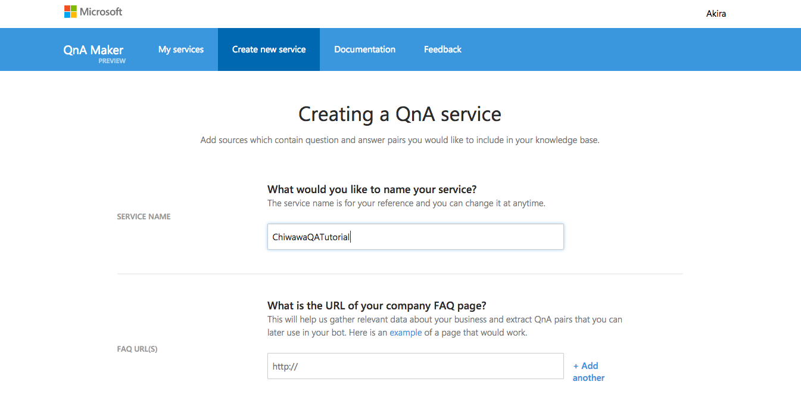
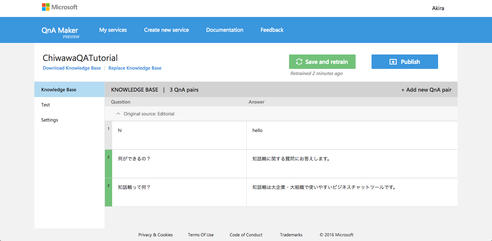
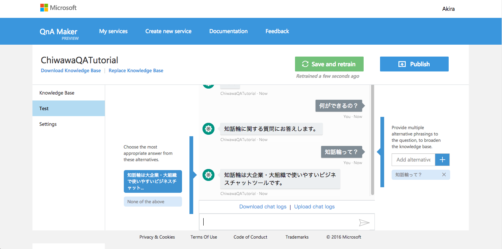
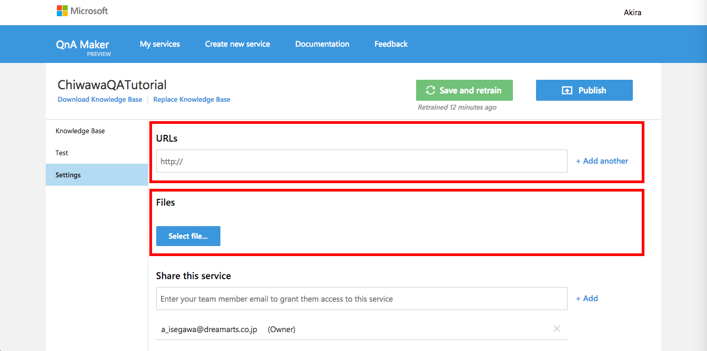
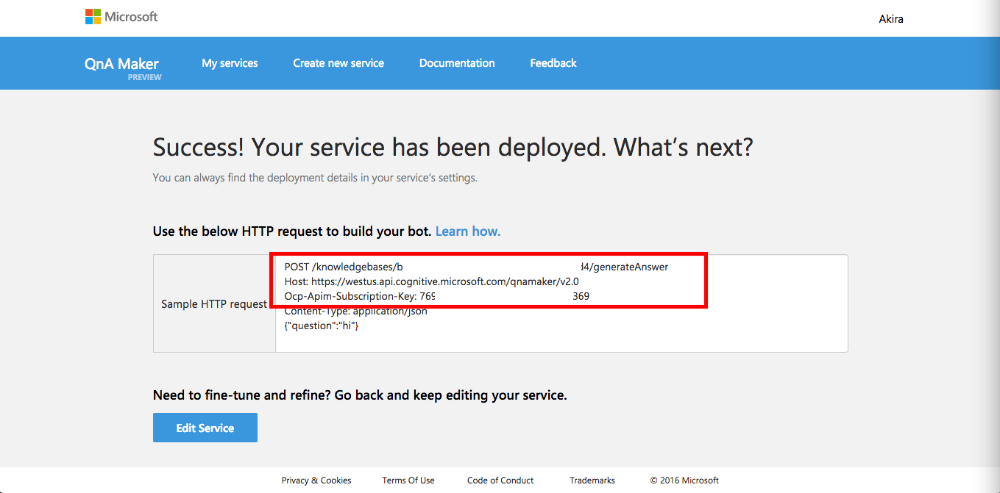

# Microsoft QnAMakerを使って、コピペだけでAIチャットボットを作る
Microsoft QnAMakerを使って、知話輪のAIチャットボットを作成する方法を紹介します。
今回もボットサーバーは構築せず、Azure Functionsを使って、<B>ブラウザ上でコピペだけで開発</B>をします。<br />

## 準備するもの
1. 知話輪のアプリ、ユーザアカウント、Bot管理権限<BR>
<B>知話輪は下記サイトからお試しいただけます</B>。自社環境で本格的にセットアップして使い始める前に手軽に試したい場合などは、下記をご利用ください。<BR>
[プロダクト無料トライアル](https://www.dreamarts.co.jp/product/trial/?ml)（[https://www.dreamarts.co.jp/product/trial/?ml](https://www.dreamarts.co.jp/product/trial/?ml)）<BR>
なお、お申込みの際は<B>「トライアルに関するご希望」欄に「API利用希望」</B>とご記入ください。
1. Microsoft Azureのアカウント
1. Chromeブラウザ

（※知話輪アプリ、ブラウザ、ログインユーザを準備するだけで、開発環境の構築は不要です。）

## 作成手順
1. 【QnAMaker】Azureにログインし、QnAMakerの利用を開始する
1. 【Azure】Functionsを作成する
1. 【知話輪管理画面】APIトークンを発行する
1. 【Azure】アプリケーション設定から、APIトークン等を環境変数に設定
1. 【Azure】サードパーティーのライブラリをインストール
1. 【Azure】コーディングをする
1. 【知話輪アプリ】アプリから動作確認をする

## 【QnAMaker】Azureにログインし、QnAMakerの利用を開始する
- QnAMakerにサインインする。
  - https://qnamaker.ai
- Create new serviceを選択し、名前を入力して「Create」ボタンを押す。<br />
<br />
- 表の右上にある「＋Add new QnA pair」を押して、質問と回答のペアを入力。その後、「Save and retrain」を押して学習をさせる。<br />
<br />
- 左メニューからTestを選択し、画面下部の「Type your message...」に質問を入力して、学習結果をテストする。想定した答えが返ってくればテスト成功。<br />
<br />
- 左メニューの「Settings」を選択すると、QAサイトのURLを入力したり、ファイルをアップロードするだけで、knowledgeベースを作ることができる。
  - URLsの欄に、QAサイトのURL（質問と答えが一つのページに書かれたもの）を指定すると、そこから自動的にQAの学習データを吸い上げてくれる。
  - Filesに、質問と回答のペアをタブ区切りで記載したファイル（TSVファイル。Excelから出力可能）をアップロードをすることで、一括でデータを登録することもできる。<br />
<br />
- 右上の「Publish」ボタンを押して公開をすると、下記のような接続情報が表示される。
    - 1行目〜3行目の情報は後に使うため、この画面を開いておく。<br />
<br />

## 【Azure】Functionsを作成する
- Microsoft Azureにログインし、ダッシュボードを表示　https://portal.azure.com
- 左のプラスボタン＞Compute＞Function App＞createを選択<br />
<br />
- Functionの名称やリージョンを選択してcreate。今回は「ChiwawaQA」とする。<br />
<br />
- functions右のプラスボタンからfunctionを作成し、javascriptのサンプルを選択
<br />
- 作成したfunctionを選択し、右上の「</> Get function URL」から、知話輪の管理画面に設定するためのWebhook URLを取得<br />
<br />

## 【知話輪管理画面】APIトークンを発行する
- 知話輪管理画面にアクセスし、下記の手順でAPIトークンを発行します。
<br />
1. https://[YOUR_COMPANY_ID].chiwawa.one/admin/login　からログイン
1. 「カスタマイズ＞Bot管理（トークン発行）＞新しく作成する」を選択
1. Azure Functionsで発行されたURLをWebhook URLにセット
1. メッセージを投稿するたびにQnAMakerが動くと邪魔なので、トリガーワードに「ChiwawaQA」と設定する。すると、「ChiwawaQA」という文字列でメッセージを投稿したときだけボットが動くようになる
1. ダイレクトメッセージを利用「する」を選択し、「登録する」ボタンを押す
1. APIトークンとWebhook検証トークンを次章でAzure Functionsの環境変数にセットするためコピー

## 【Azure】アプリケーション設定から、APIトークン等を環境変数に設定
- functionsの概要画面を表示し、「Application settings」をクリック。
<br />
- 知話輪のトークンと、QnAMakerの接続情報を環境変数にセット。
<br />

| 環境変数名 | 値 |
|---|---|
| CHIWAWA_API_TOKEN | 知話輪のAPIトークン |
| CHIWAWA_VALIDATION_TOKEN | 知話輪のWebhook検証用トークン |
| QA_KNOWLEDGEBASE_PATH | QnAMakerのPOSTの次に記載してあるパス |
| QA_KNOWLEDGEBASE_HOST | QnAMakerのHOST URL |
| QA_SUBSCRIPTION_KEY | QnAMakerのSUBSCRIPTIONキー |

- QnAMakerの接続情報は、QnAMakerのPublish後の画面に表示される。
<br />

## 【Azure】知話輪のSDKをインストール
- 下記のURLにてコマンドラインツール（Kudu）を立ち上げる。
```
https://YOUR_APP_NAME.scm.azurewebsites.net/DebugConsole
```
- YOUR_APP_NAMEは設定画面のOverviewに表示されるURLから取得できる。例えば、下記の場合のYOUR_APP_NAMEは「chiwawaqasample」となる。<br />
<br />
- 正しいURLを打つと下記のようなコマンドラインツールの画面に遷移する。<br />
<br />
- ライブラリをインストールするため、npm initでpackage.jsonを作成する。（直接JSONを書いてもよい）
- 知話輪のSDKをインストールする。
```
cd D:\home\site\wwwroot\YourFunctionName
npm init
npm install chiwawa_node_sdk --save
```

## 【Azure】コーディングをする
以下は、知話輪にメッセージが投稿された際に、QnAMakerに問合せに行き、その回答を知話輪にメッセージとして投稿するという内容。
QnAMakerの設定をきちんと行っておけば、QAボットやその他の対話ボットが作れる。
下記のコードをAzure Functionsのindex.jsにコピーするだけでボットが完成する。

```.js
var request = require('request');
const ChiwawaService = require("chiwawa_node_sdk");
module.exports = function (context, req) {
    if (ChiwawaService.isValidRequest(req, context)) {
        let messageText = ChiwawaService.getMessageText(req);
        if (messageText) {
            // トリガーワードを削除
            messageText = messageText.replace(/^ChiwawaQA/i, "");
        }
        // QAサービスに問い合わせ
        FAQService.searchFAQ(messageText, (err, httpResponse, body, answer) => {
            ChiwawaService.sendMessage(req, answer, (err, httpResponse, body) => {});
        });
    }
};

const FAQService = {
    FAQ_URL: process.env["QA_KNOWLEDGEBASE_HOST"] + process.env["QA_KNOWLEDGEBASE_PATH"],
    searchFAQ: function(question, callback) {
        const headers = {
            'Content-Type': 'application/json',
            'Ocp-Apim-Subscription-Key': process.env["QA_SUBSCRIPTION_KEY"]
        };
        const options = {
            url: this.FAQ_URL,
            headers: headers,
            json: {"question": question}
        }
        request.post(options, function(err, httpResponse, body) {
            let answer = "よくわかりません。人間に聞いてください。";
            if (!err && body && body.answers && 0 < body.answers.length) {
                const firstAnswer = body.answers[0];
                if (30 < firstAnswer.score) {
                    answer = body.answers[0].answer;
                }
            }
            if (callback) callback(err, httpResponse, body, answer);
        });
    }
};
```

## 【知話輪アプリ】アプリから動作確認をする
- 左メニューのプラスボタンからボットユーザを追加する
<br />
- 自分が作成したボット（ChiwawaQA）を選択する　（※自分が作成したbotが出てこない場合は、知話輪管理画面で、「ダイレクトメッセージ利用」を「する」になっていることを確認してください。）
<br />
- 「ChiwawaQA」で始まるメッセージを投稿するとAIが適当に返事をしてくれる。
<br />

以上で、QnAMakerを用いた知話輪ボットは完成です。

## 参考資料
- [知話輪とは](https://www.chiwawa.one/)
- [知話輪のAPIドキュメント](https://developers.chiwawa.one/api/)
- [知話輪SDK for Node.js](https://github.com/DreamArtsChiwawa/chiwawa_node_sdk)
- [Microsoft QnA Makerのサイト（英語）](https://qnamaker.ai/)
- [Microsoft QnA Makerのドキュメント（英語）](https://qnamaker.ai/Documentation)
