# 開発環境構築手順（Mac用）

## 目次
1. [はじめに](#はじめに)
    - [【既存の環境と、これから必要な用意】](#既存の環境とこれから必要な用意)
    	- [開発に必要な環境](#開発に必要な環境)
    	- [すでに用意されている環境](#すでに用意されてる環境)
    	- [自身で構築しなければならない環境](#自身で構築しなければならない環境)
1. [AppStore](#AppStore)
    - [Apple IDの設定](#Apple_IDの設定)
1. [Xcode](#Xcode)
    - [Xcodeのインストール](#Xcodeのインストール)
1. [Homebrew](#Homebrew)
    - [Homebrewのインストール](#Homebrewのインストール)
    - [Homebrewの確認](#Homebrewの確認)
    - [Homebrewでのパッケージのインストール](#Homebrewでのパッケージのインストール)
    - [参考資料](#Homebrew参考)
1. [Git](#Git)
    - [Gitのインストール](#Gitのインストール)
    - [Gitの確認](#Gitの確認)
    - [Gitを使用する設定](#Gitを使用する設定)
    - [Gitの初期設定](#Gitの初期設定)
    - [参考資料](#Git参考)
1. [Node.js](#Node.js)
    - [Node.jsのインストール](#Node.jsのインストール)
    - [Node.jsのnpmライブラリの追加](#Node.jsのnpmでライブラリの追加)
    - [参考資料](#Node.js参考)
1. [Heroku](#Heroku)
    - [heroku toolbelt](#herokutoolbelt)
        - [heroku toolbeltのインストール](#herokutoolbeltのインストール)
        - [heroku toolbeltでアプリを公開](#herokutoolbeltでアプリを公開)
        - [2段階認証 (two-factor authentication)](#2段階認証)
        - [参考資料](#Heroku参考)
1. [Chiwawa Admin](#ChiwawaAdmin)
    - [ChiwawaでAPIトークンを確認](#ChiwawaでAPIトークンを確認)
1. [Github](#Github)
    - [Githubの登録](#Githubの登録)
    - [参考資料](#Github参考)

<br>

---

##  1. はじめに

<br>
Node.jsとHerokuを用いて、ボットを作るための開発環境の構築手順を紹介します。


---

## 【既存の環境と、これから必要な用意】

<a name="開発に必要な環境"></a>

<br>

### 開発に必要な環境

<font size="4">

[WebAPI / WebHooks / BOTの利用イメージ](#利用イメージ)をもとに、環境の用意をします。
まずは、以下の図を見てください。


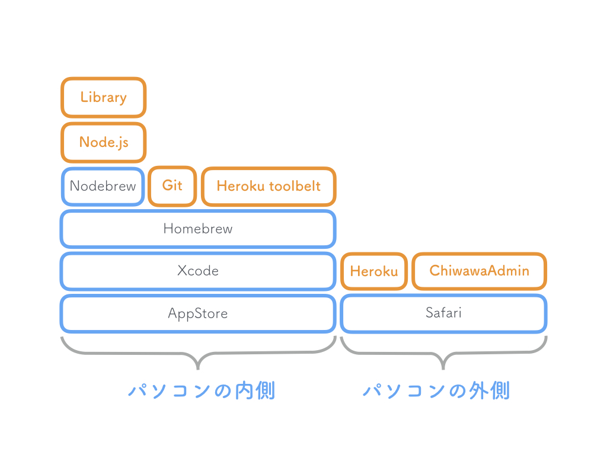

オレンジの枠線で囲まれた要素が、最終的に必要となるものです。<br>
そしてそれらを用意するためには、それぞれ一段下に配置されている要素を用意する必要があります。

<a name="すでに用意されている環境"></a>


<br>

</font>

### すでに用意されている環境

<font size="4">

BOTアプリを作成するにあたり、パソコンの中にすでに用意されている要素は以下の通りです。

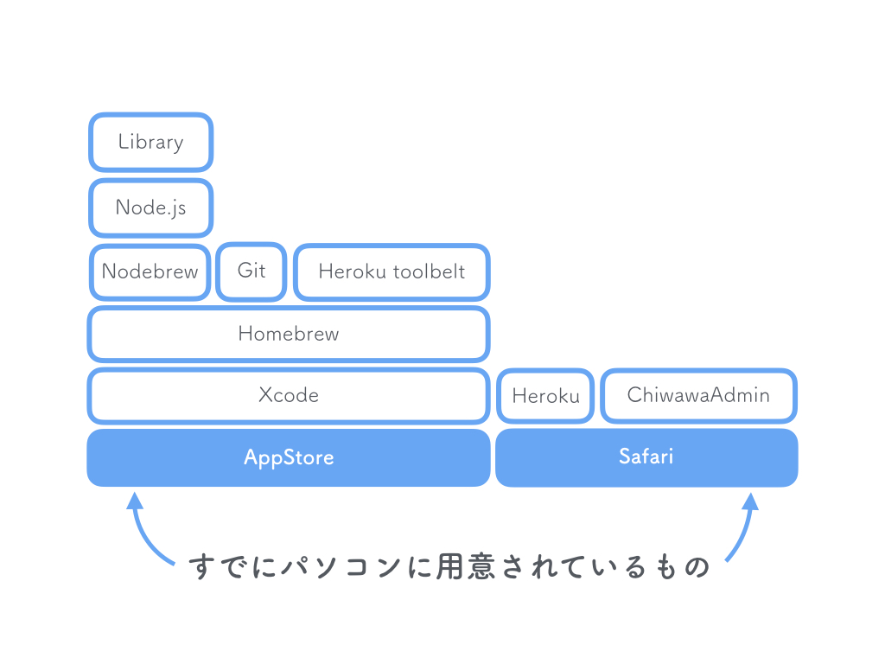


これらはどちらも標準のアプリケーションです。
AppStoreとSafariのそれぞれを起動して、まずは一段上に位置する

- Xcode (えっくすこーど)
- Heroku
- ChiwawaAdmin (ちわわあどみん)

の準備から始めましょう。次のドキュメントで具体的な手順の説明をしますので、今は環境を構築するのに必要な順番を理解してください。
<br><font color = grey>(Safariは、Chrome、firefoxなど他のブラウザアプリを使用することも可能です)</font>

<br>

<a name="自身で構築しなければならない環境"></a>


<br>


### 自身で構築しなければならない環境

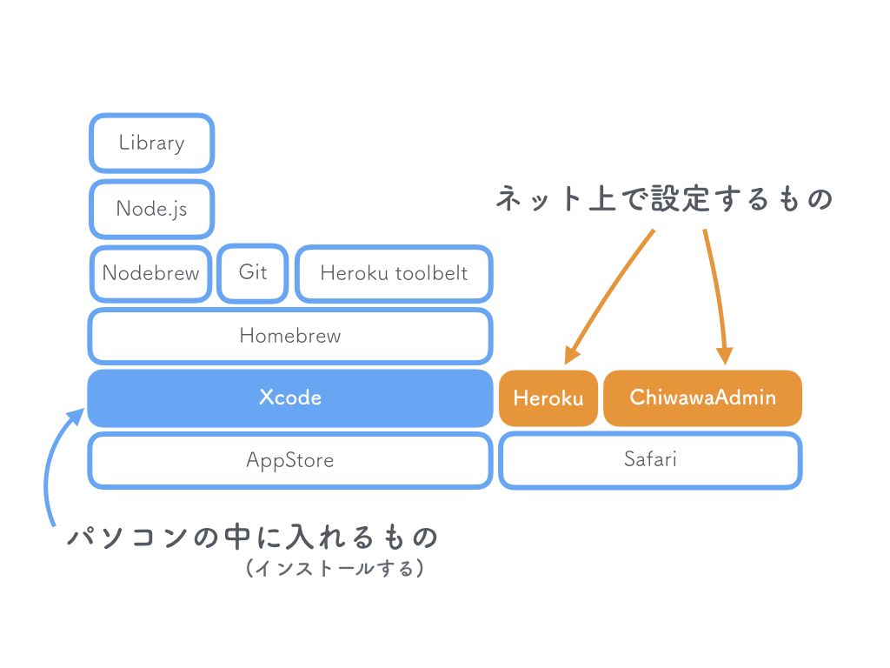

インターネット上で、HerokuとChiwawaAdminの設定を行います。<br>
この二つに関してはこれで完了です。<br>
<br>
AppStoreを利用してXcodeのインストールが完了したら、次はXcodeを基盤にHomebrewをインストールします。このように、段階的に必要なものをインストールしていき、最終的に必要な環境を構築します。

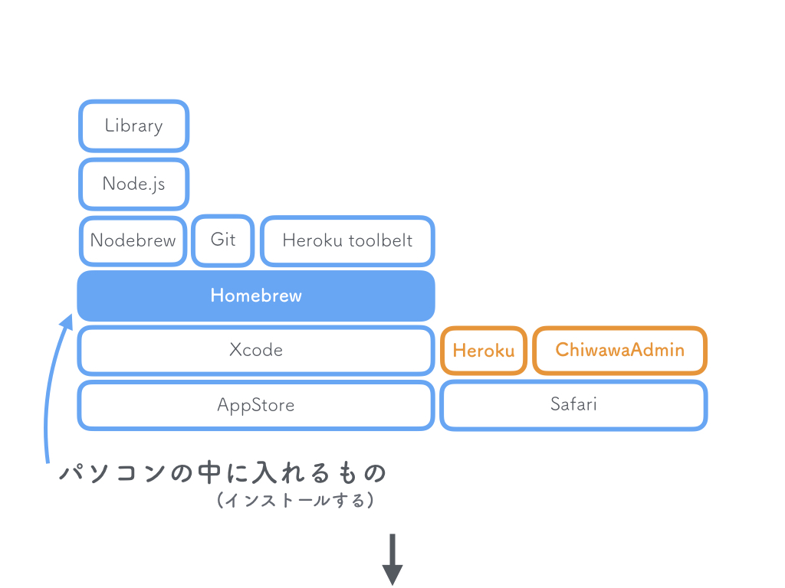
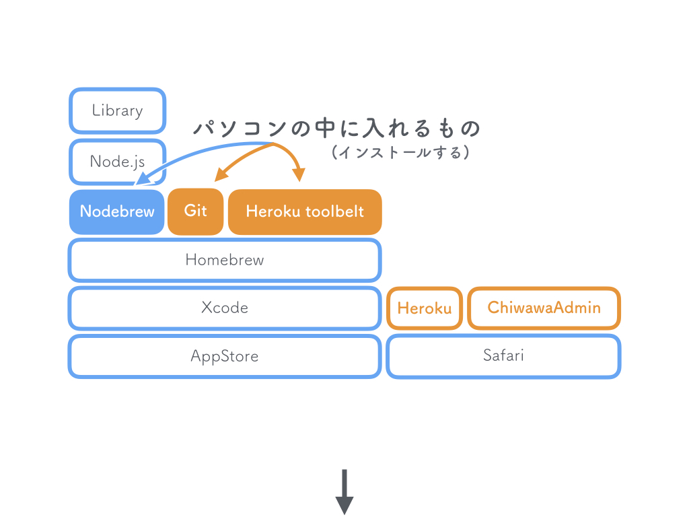
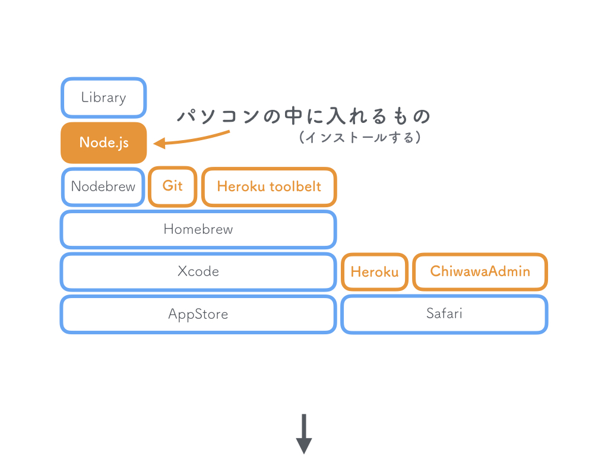
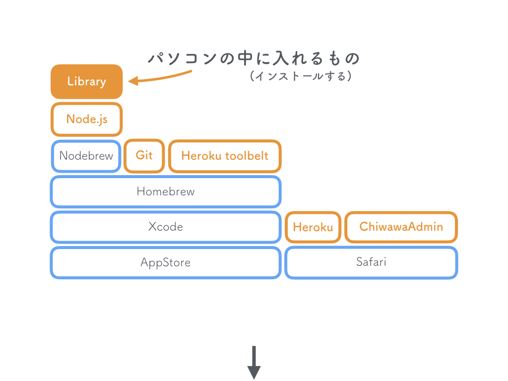

</font><font size ="5">

それでは、今の手順を実際に自分のパソコンで再現します。
次のドキュメントに進んでください。

</font>


<br><br>

<a name="AppStore"></a>
<br><br><br>
## 2. AppStore

    この章では、AppleアカウントでAppStoreにサインインするための手順を説明します。  
    読む必要のない方は[次の章](#Homebrew)に飛んでください。

<a name="Apple_IDの設定"></a>

### Apple IDの設定

1. [Apple ID を作成 | Apple Inc.](https://appleid.apple.com/account#!&page=create)からApple IDを作成

    AppStore上で必要なアプリケーションを購入、またはインストールするためには、Appleアカウントを所有している必要があります。アカウントをまだお持ちでない場合、Apple IDを作成してアカウントを入手しましょう。  
    <br>
    [<h3>Apple IDを作成</h3>](https://appleid.apple.com/account#!&page=create)
    ウェブページを開いたら、画像のように空欄に必要事項を記入してください。

    <br>

    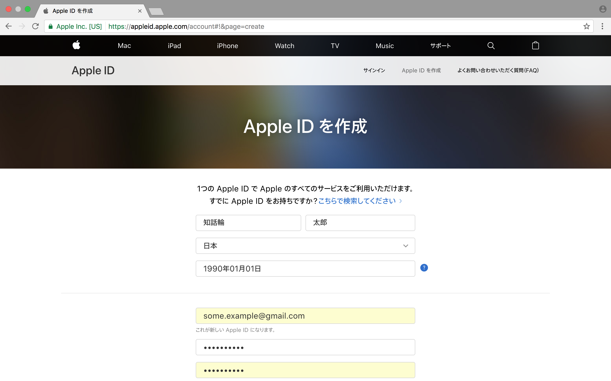

    <br>
    いくつかの質問に回答することで、Apple IDを取得し、アカウントの作成が完了します。  
    <br><br>

1. 『App Store』アプリケーションを開き、メニューバーの『store』からサインインする

    アカウントが作成できたら、今度はそのアカウントでAppleStoreに入ります。  
    パソコンのアプリケーション一覧から、 『AppStore』を起動させてください。  
    <br>ツールバー(デスクトップ上部のメニュー一覧)から『Store』を選択すると、メニューがいくつか表示されます。その中から『サインイン』を選択することで、先ほど作成したアカウントを利用することができます。

    <br>

    

<a name="Xcode"></a>
<br><br><br><br>
## 3. Xcode

    作成したAppleアカウントを利用して、AppStoreからXcodeを入手します。  

<a name="Xcodeのインストール"></a>

#### Xcodeのインストール

1. Webブラウザで、[iTunes 公式ホームページ](https://itunes.apple.com/jp/app/xcode/id497799835?mt=12)を開く   
    <br>

    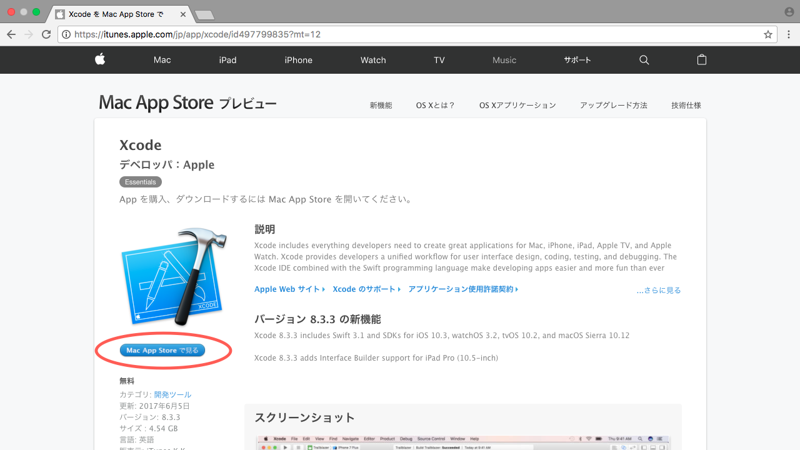  

    <br>
    『Mac App Storeで見る』を押下すると、自動でAppStoreのアプリケーションが起動します。そのまま、『入手』あるいは『インストール』を押してください。

    > ここで、Apple IDとパスワードの入力を求められることがあります。先ほど作成したAppleアカウントのメールアドレス・パスワードをそれぞれ記入してください)  

    <br>

1. ライセンス使用許諾契約に同意。FinderからXcodeを起動できる状態になる

    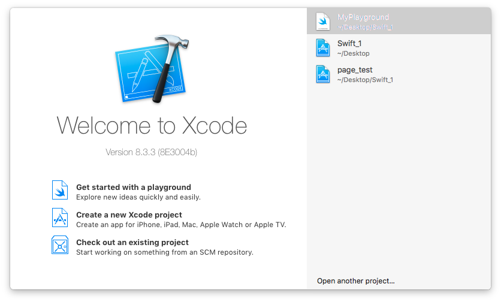  

    <br>
    これでXcodeのインストールは完了です。


1. Homebrewのインストールに必要なCommand Line Tools for Xcodeのインストール。

      ```
      xcode-select --install
      ```

      > xcode-select: note: install requested for command line developer tools

1. 使用許諾契約画面が表示される。『インストール』を選択したのち、『同意する』をクリック


<a name="Homebrew"></a><br>
<br><br><br><br>
## 4. Homebrew

<a name="Homebrewのインストール"></a><br>

#### Homebrewのインストール


1. 『ターミナル』アプリケーションを起動

    > 『アプリケーション』ディレクトリの中にある、『ユーティリティ』というフォルダに入っていることが多いです。もし見つけられない場合は、`⌘`と`スペースキー`を同時に押すと検索ウィンドウが開きます。(Spotlightという機能です)

    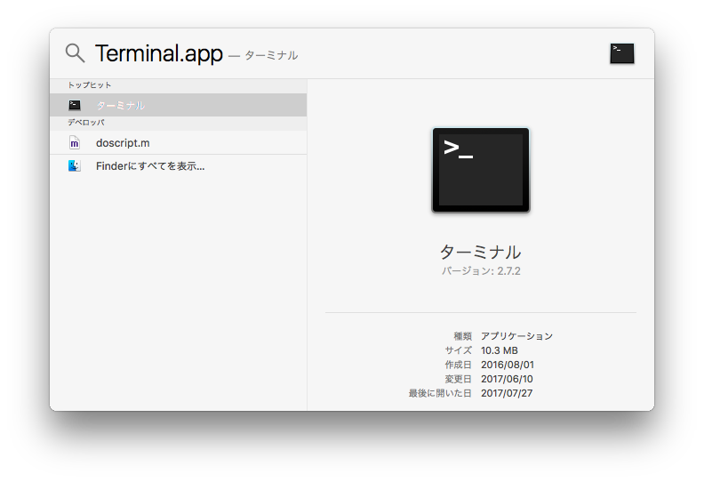

2. Homebrewのインストールに必要な『Command Line Tools for Xcode』をインストール  
    <br>
    ターミナルを用いてXcodeにインストールをします。  
    以下の文字列をコピー、『ターミナル』上にペーストして、エンターキーを押下します。この時、ターミナルのウィンドウのタイトルバーに『-bash』と書かれていることを確認した上で行ってください。


    ```
    xcode-select --install
    ```

    出力結果として、最終的に以下が表示されます。

    > xcode-select: note: install requested for command line developer tools  

    <br>

2. 使用許諾契約画面が表示される。「インストール」ボタンを押した後「同意する」をクリック

1. [Homebrew 公式ホームページ](https://brew.sh/index_ja.html)のインストールに書かれているRubyコマンドをコピー  
    <br>
    Homebrew本体のインストールです。ウェブサイトにアクセスし、必要なコードを選択、コピーします。

    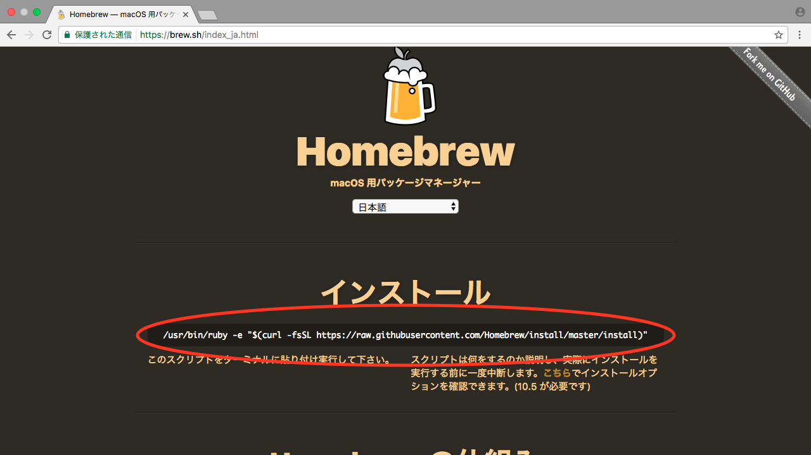  
    <br>
    あるいは、ここにサイトから引用したコードがあります。

    ```
    /usr/bin/ruby -e "$(curl -fsSL https://raw.githubusercontent.com/Homebrew/install/master/install)"
    ```

    先程と同様、ターミナルにペーストしてエンターキーを押下してください。

    

1. インストールの確認を求められるので、エンターキーを押して同意

    > Press RETURN to continue or any other key to abort

1. login passwordを求められるので、パスワードを入力し、エンター  

    ここで入力するパスワードは、パソコン本体の管理者パスワードです。

    > Password:

    入力するとHomebrewのインストールが始まり
、しばらくすると以下が表示されて完了。

    > Install successful!

<a name="Homebrewの確認"></a><br>

#### Homebrewの確認

1. brewコマンドが正しく動いているのかを確認するために、ターミナルにバージョンを表示する。  
以下のコマンドを入力してください。

    ```
     brew -v
    ```

    実行して、`Homebrew x.x.x`のように表示されていることを確認します。(2017/07/27 執筆時：`Homebrew 1.2.4`)

    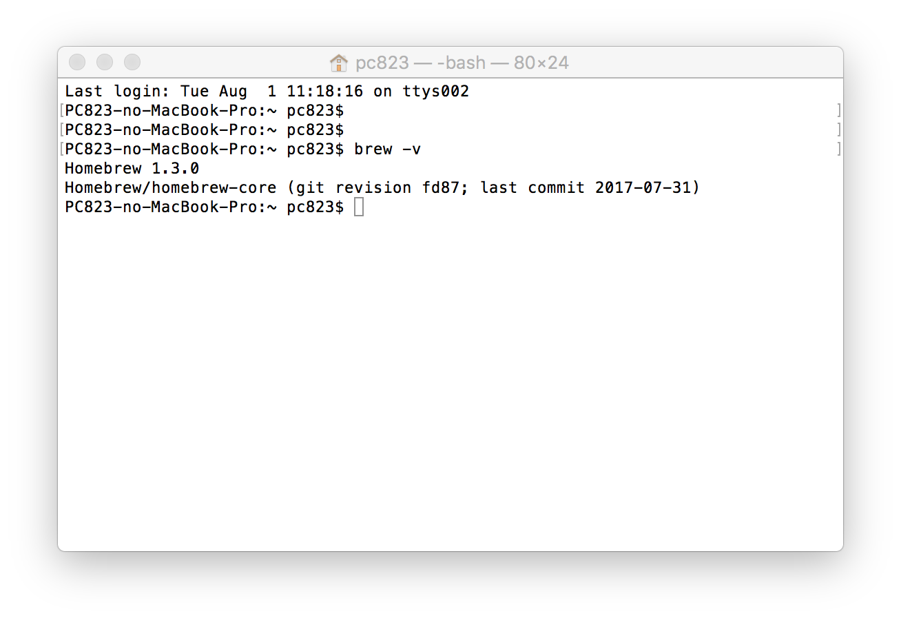

1. Homebrewに問題がないかを確認するために、ターミナルで以下のコマンドを実行

    ```
     brew doctor
    ```

    実行して、`Your system is ready to brew.`と表示されるのを確認します。

    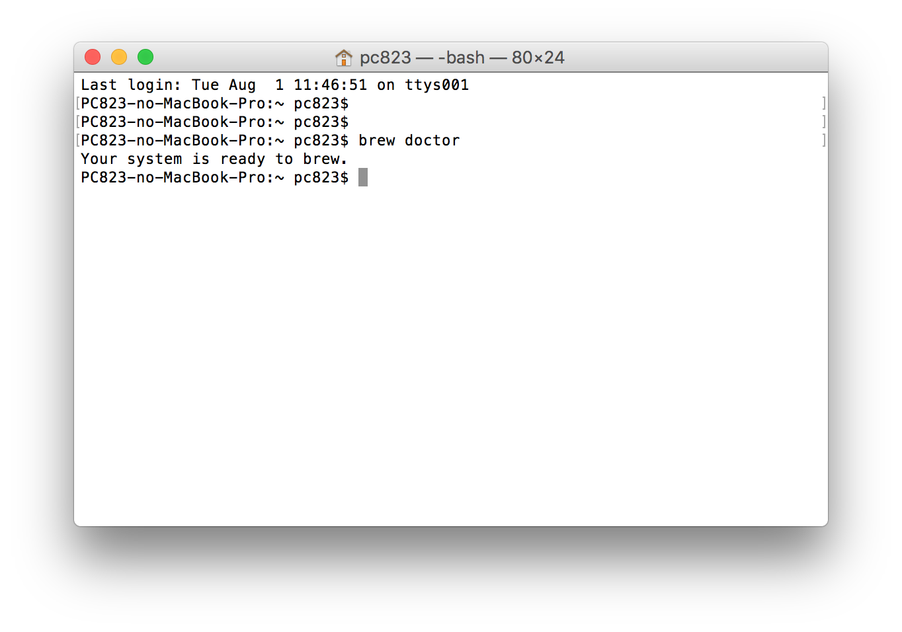

<a name="Homebrewでのパッケージのインストール"></a><br>

#### Homebrewでのパッケージのインストール

1. Homebrew本体のアップデートを実行  
    最新のパッケージをインストールできるようにするために行います。  
    以下のコマンドを入力してください。

    ```
     brew update
    ```

    画像は、すでにアップデートが済んだpcのものです。

    

1. Homebrewで入手したパッケージのアップデートを実行  
以下のコマンドを入力します。

    ```
    brew upgrade
    ```

1. 実際にHomebrewで任意のパッケージをインストールするとき

    例として、架空のパッケージ{some-package-name}をインストールすると仮定します。  
    その際は、ターミナルに以下のコマンドを順に入力することでインストールが可能です。

    ```
    brew search {some-package-name}
    ```
    ```
    brew install {some-package-name}
    ```

<a name="Homebrew参考"></a><br>

#### 参考資料

1. 参考URL

    * [Homebrew 公式ホームページ](https://brew.sh/index_ja.html)
    * [MacにHomebrewをインストールする](http://qiita.com/_daisuke/items/d3b2477d15ed2611a058)
    * [Mac OS X - Homebrew のダウンロードとインストール](https://webkaru.net/dev/mac-homebrew-install/)
    * [Homebrew使い方まとめ](http://qiita.com/vintersnow/items/fca0be79cdc28bd2f5e4)
    * [homebrewとは何者か。仕組みについて調べてみた](http://qiita.com/omega999/items/6f65217b81ad3fffe7e6)

<a name="Git"></a><br>

## 5. Git

<a name="Gitのインストール"></a><br>

#### Gitのインストール

1. ターミナルで、インストールされたgitのバージョンを確認  
以下のコマンドを入力、実行します。

    ```
     /usr/bin/git --version
    ```

    以下が表示されます。(2017/07/27 執筆時)
    > git version 2.11.0 (Apple Git-81)

    

1. HomebrewからGitがインストールされていないことを確認

    以下のコマンドをそれぞれ入力します。
    ```
    brew update  
    ```
    ```
    brew list | grep git
    ```

    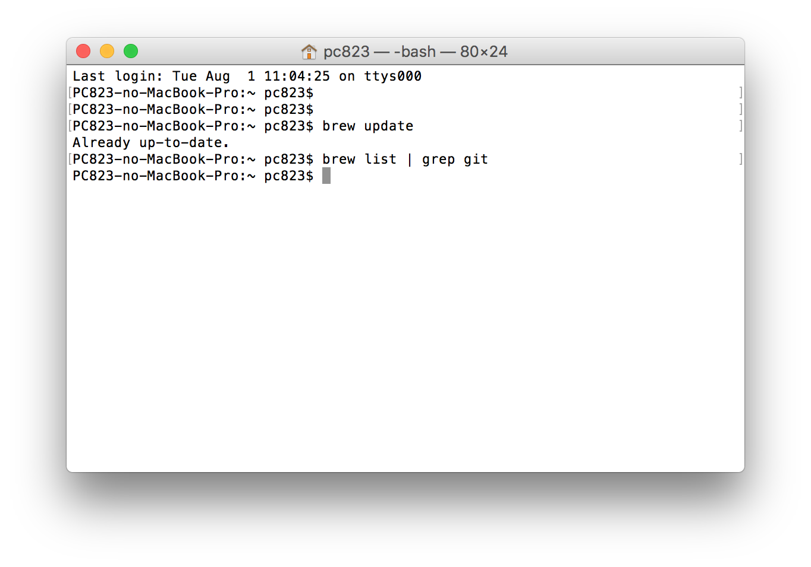

1. Homebrewでインストールできるgitの安定バージョンを表示  
    以下を入力します。

    ```
    brew info git | grep stable
    ```

    以下が表示されます。
    > git: stable 2.13.3 (bottled), HEAD

    

1. HomebrewからGitをインストール  
    以下を入力します。

    ```
    brew install git
    ```
    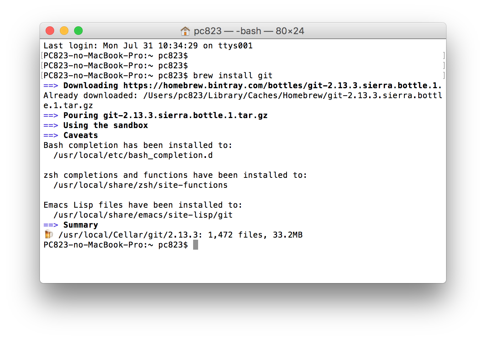

<a name="Gitの確認"></a><br>

#### Gitの確認

1. Homebrewからgitがインストールされたのかを確認  
    以下をそれぞれ入力します。

    `brew list | grep git`  
    `which git`  
    `git --version`


    > git version 2.13.3

    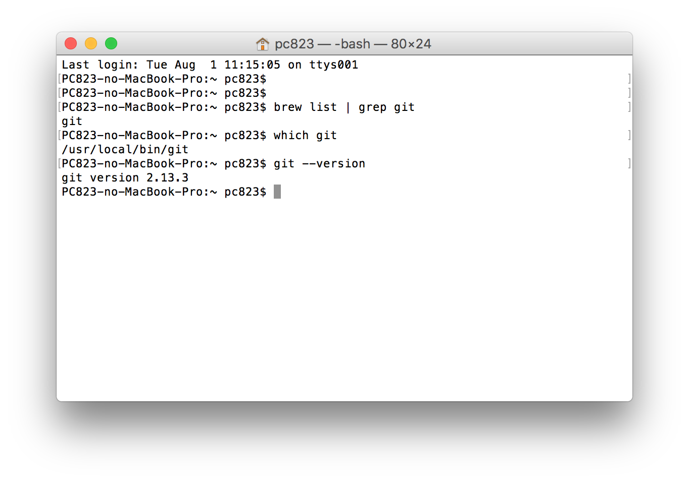

<a name="Gitを使用する設定"></a><br>

#### Gitを使用する設定

1. Homebrewからインストールした`git(2.13.3)`を有効にする   
    この設定は、`git --version`が`git version 2.11.0 (Apple Git-81)`のときに行います。  
    以下のコマンドをそれぞれ入力してください。

    ```Bash
    cd ~
    touch .bash_profile .bash_rc
    echo 'export  PATH=/usr/local/bin:$PATH' >>  ~/.bash_profile
    source ~/.bash_profile
    git --version
    ```


<a name="Gitの初期設定"></a><br>

#### Gitの初期設定

1. gitを使用するときにする初期設定

    以下をターミナル上にコピー＆ペーストしてください。

    ```
    git config --global user.name "Taro_Chiwawa"
    git config --global user.email some.example@gmail.com

    git config --global color.ui true

    git config --global core.editor "vim"

    git config --list
    ```

<a name="Git参考"></a><br>

#### 参考資料

1. 参考URL

    * [HomebrewでGitをインストールする](http://qiita.com/micheleno13/items/133aee005ae37c28960e)
    * [MacのHomeBrewでGitを2.7.0にアップデートしよう](http://qiita.com/suzutan/items/44bcf20df711675c525c)
    * [OS X で Homebrew を使って git の最新バージョンを入れようとしてうまくいかなかったときの対応](http://we.fnshr.info/2016/03/13/homebrew-git/)
    * [MacにHomebrewを使ってGitを導入＆初期設定](http://vdeep.net/mac-homebrew-git)
    * [MacにhomebrewでGitをインストール](http://www.yukun.info/blog/2015/05/install-git-by-mac-homebrew.html)

<a name="Node.js"></a><br>

## 6. Node.js

<a name="Node.jsのインストール"></a><br>

#### Node.jsのインストール

1. Node.jsがインストールされているかを確認  
以下の手順でNode.jsがインストールされているかを確認します。  
もしすでにインストールされていたら、[参考](#Node.js参考)を読んでNode.jsを一度削除してから、同様にインストールしてください。

    以下のコマンドを入力してください。

    ```
    node -v | grep ^v
    ```

1. Homebrewからnodebrewをインストール

    ```
    brew update
    brew list | grep nodebrew || brew install nodebrew
    ```

1. nodebrewが確かにインストールされたのかを確認

    ```
    nodebrew -v
    ```

    > 表示結果：  
    > nodebrew 0.9.7
    >
    > Usage:

1. nodebrewから任意のバージョンのNode.jsをインストール  (今回は、6.11.1とする。最新版ならばlatestを指定)

    以下のコマンドを入力してください。

    `nodebrew ls-remote`  
    `nodebrew install-binary v 6.11.1`  
    `nodebrew ls`  

    > 表示結果：  
    > v6.11.1
    >
    > current: none

5. nodebrewからインストールしたNode.jsのバージョンを有効化

    `nodebrew use v6.11.1`  
    `nodebrew ls`  
    > 表示結果：  
    > v6.11.1
    >
    > current: v6.11.1

6. nodeコマンドだけで実行できるように、nodeコマンドのあるパスをbash_profileに追加

    `which node | grep /usr/local/bin/node && echo 'export PATH=$HOME/.nodebrew/current/bin:$PATH' >> ~/.bash_profile`  
    `source ~/.bash_profile`  
    `node -v`  

    > 表示結果：  
     v6.11.1

<a name="Node.jsのnpmでライブラリの追加"></a><br>

#### Node.jsのnpmでライブラリの追加

1. npmが動作するか確認  
npmのバージョンを表示させることで、動作していることを確認します。

    ```
    npm -v
    ```

    > 3.10.10

1. パッケージの依存関係が記述された「package.json」を生成。  
    (ホームディレクトリのmy_appにnode.jsプログラムを記述すると仮定)

    `cd`  
    `mkdir my_app`  
    `cd ./my_app`  
    `npm init  --yes`  

    > Wrote to /Users/pc823/my_app/package.json:
    >
    > {
    >   "name": "my_app",  
    >   "version": "1.0.0",  
    >   "description": "",  
    >   "main": "index.js",  
    >   "scripts": {  
    >    "test": "echo \"Error: no test specified\" && exit 1"  
    >   },  
    >   "keywords": [],  
    >   "author": "",  
    >   "license": "ISC"  
    > }  


1. Node.jsのパッケージ管理ツールnpmで`express`, `request`, `body-parser`ライブラリを追加

    以下のコマンドを入力してください。

    ```
    npm install express request body-parser --save
    ```

    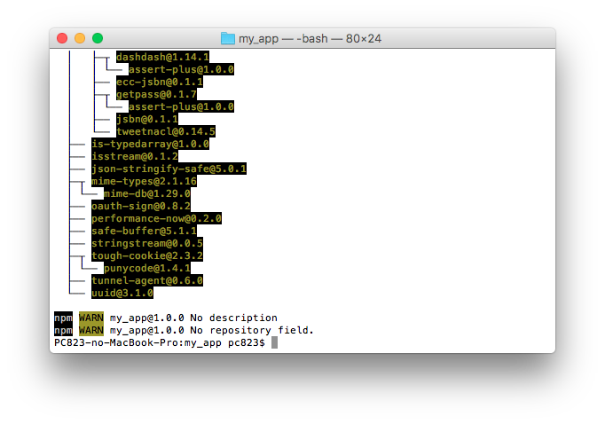

1. `.gitignore`ファイルを作り、`node_modules`以下のファイルを含めないようにする。  
(含めると、ファイルサイズが大きくなってしまう。また`npm install`で簡単に他の環境でも再現できるため含める必要がないから。)

    `touch .gitignore`  
    `echo 'node_modules/*' >> .gitignore`  
    `cat .gitignore`  

    > node_modules/*

<a name="Node.js参考"></a><br>

#### 参考資料

1. Macintosh InstallerでダウンロードしたNode.jsをアンインストール。以下のコマンドを1行ずつコピーしてBashに貼り付ける。

    `lsbom -f -l -s -pf /var/db/receipts/org.nodejs.pkg.bom \`  
    `| while read i; do`  
    `sudo rm /usr/local/${i}`  
    `done`  
    `lsbom -f -l -s -pf /var/db/receipts/org.nodejs.node.pkg.bom \`  
    `| while read i; do`  
    `sudo rm /usr/local/${i}`  
    `done`  
    `sudo rm -rf /usr/local/lib/node \`  
    `/usr/local/lib/node_modules \`  
    `/var/db/receipts/org.nodejs.*`  
    `sudo rm -rf ~/.npm`  

1. 参考URL

    * [Macにnode.jsをインストールする手順。](http://qiita.com/akakuro43/items/600e7e4695588ab2958d)
    * [Mac OS X から Node.js をアンインストールする方法](http://d.sonicjam.co.jp/post/52541343939)
    * [MacにpkgでインストールしたNode.jsをアンインストールする手順](http://qiita.com/yoshikoba/items/4906829faaaae8c73e56)
    * [npmコマンドの使い方](http://qiita.com/yoh-nak/items/8446bf12094c729d00fe)
    * [npmとpackage.json](http://qiita.com/Sekky0905/items/452619651cdd950c2271)
    * [Using a package.json](https://docs.npmjs.com/getting-started/using-a-package.json)

<a name="Heroku"></a><br>

## 7. Heroku

<font size="5">

> [[Node.js公式サイト]](https://nodejs.org/ja/)

<a name="Heroku"></a>
<br>

Herokuはクラウドのアプリケーションプラットフォームです。ユーザは自分が開発したアプリをHeroku上に乗せるだけで、面倒なインフラ構築の作業をしなくても、簡単にWebサービスを開始することができます。
今回の例では、Herokuを利用して、ボットを製作するため、簡単にHerokuのセットアップ手順を紹介します。

<br><br>

1. [Heroku 公式ホームページ](https://www.heroku.com/)からHerokuアカウントの登録

    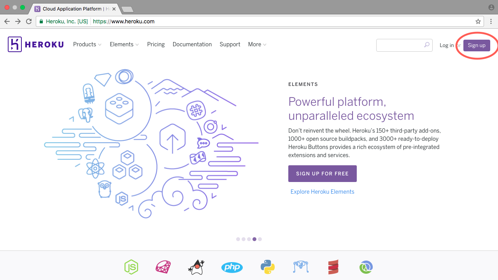

    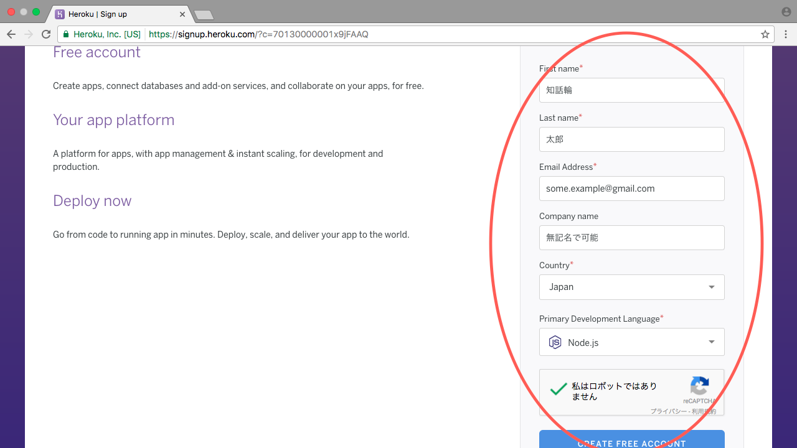

1. 登録時に指定したメールアドレスに確認用のメールが来る  
メール内にあるリンクをクリックするとパスワード入力画面に遷移します。

    > Thanks for signing up with Heroku! You must follow this link to activate your account:  
    > https://id.heroku.com/acount/accept/vneufakm...

1. パスワード設定画面でパスワードを入力し、「Set password and log in」を選択

<a name="herokutoolbelt"></a><br>
<br><br><br>

### heroku toolbelt

<a name="herokutoolbeltのインストール"></a><br>

#### heroku toolbeltのインストール

1. heroku toolbeltのインストール  
以下のコマンドを順に実行する。

    `brew update`  
    `brew install heroku`  
    `which heroku`  
    `heroku -v`  

    最後に以下が表示されれば大丈夫です。

    > (darwin-x64) node-v8.2.1

<a name="herokutoolbeltでアプリを公開"></a><br>

#### heroku toolbeltでアプリを公開

1. ターミナルからHerokuにログイン

    以下のコマンドを入力、実行します。

    ```
    heroku login
    ```

    表示に従い、Herokuアカウント作成時に登録したメールアドレスとパスワードを入力してください。
    >Enter your Heroku credentials:  
    Email:

    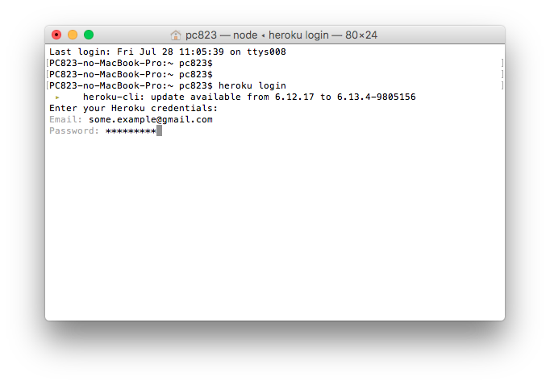

1. アプリを置くディレクトリを作製

    今回はホームディレクトリに、some_myappディレクトリを配置します。  

    `cd ~`  
    `mkdir some_myapp`  
    `cd ./some_myapp`  

1. some_myapp内にプログラムを記述

    ここでのプログラムは、知話輪APIを用いて作成したBOTプログラムです。

1. アプリをgit管理。

    `git init`  
    `git add .`  
    `git commit -m "first commit"`  

    <a name="some-app-name-01234567"></a><br>

1. heroku上にアプリケーションを作製(今回は仮として`some-app-name-01234567`とする)  
    この時、2つのURLを記録しておく。(知話輪管理画面でWebhookに使用するURLと、herokuにデプロイするgitリポジトリ)  
    以下のコマンドをターミナルに入力、実行します。

    ```
    heroku create some-app-name-01234567
    ```

    >Creating some-app-name-01234567... done, stack is cedar
http://some-app-name-01234567.herokuapp.com/ | git@heroku.com:some-app-name-01234567.git
Git remote heroku added

    - http://some-app-name-01234567.herokuapp.com/
        - Webhookで使用するURL(今回は、知話輪サーバからBotサーバに情報を送信するURL)
    - git@heroku.com:some-app-name-01234567.git
        - Herokuサイトにあるgitリポジトリ(今回は、Botサーバのプログラムが置かれるURL)

1. アプリをHerokuにデプロイ(プログラムをアップロード)

    ```
    git push heroku master
    ```

<a name="2段階認証"></a><br>

#### 2段階認証 (two-factor authentication)

    Herokuを管理する上でセキュリティ強度を高めるため、アカウントのログインを従来の『メールアドレス』『パスワード』に加え、スマートフォン端末を利用した二重ロックをかけることにします。

1. アカウントの『Setting』を選択

    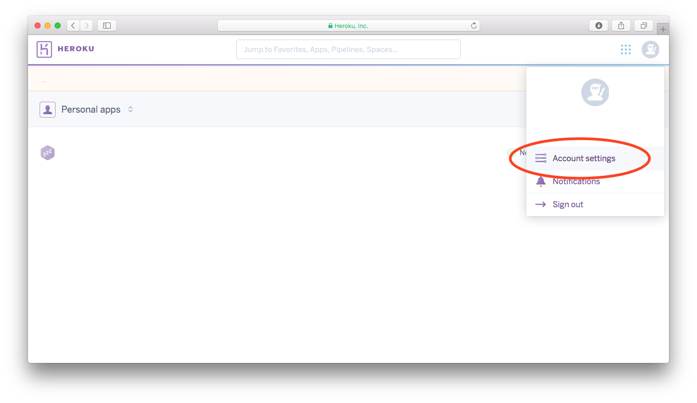

1. Dashboard account pageにある『Two-factor Authentication』の『Enable two-factor authentication』をクリック。

    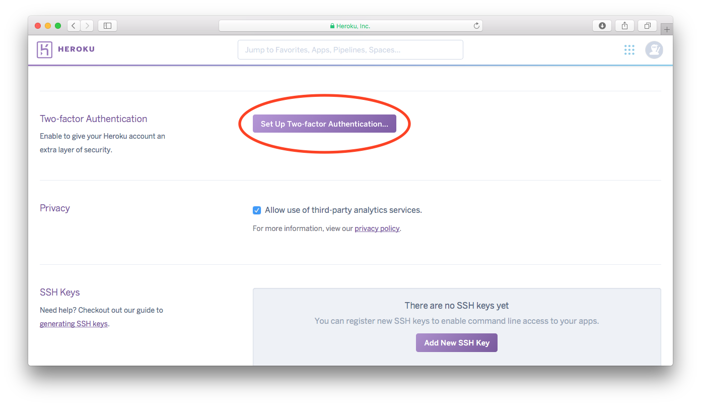

    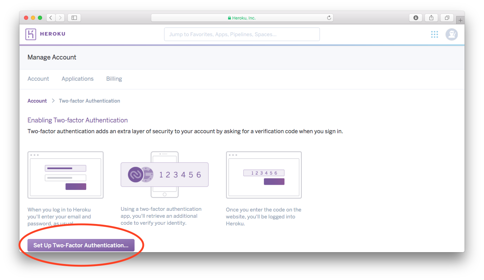

    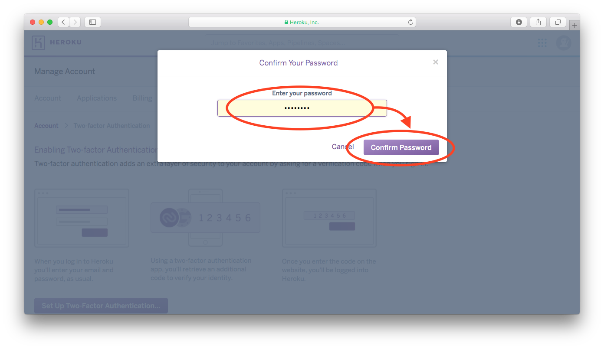

1. Google Store または App Storeから『Google Authentication』をダウンロード。HerokuのDashboardにあるQRコードを『Google Authentication』からスキャンし、『Verify your code』の欄に『Google Authentication』で表示されている6桁の数字を入力。

    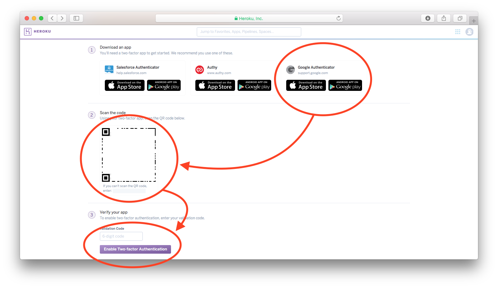


1. リカバリーオプションで電話番号をHerokuに登録  

    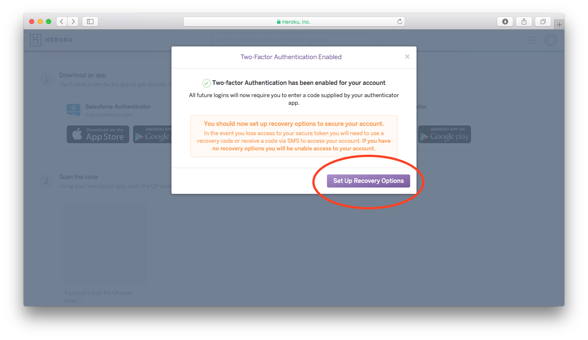

    このとき、国際規格に従った番号を入力するため先頭に「+81(日本)」と書き、一文字目を消す必要があります。ハイフンの有無は関係ないので、あってもなくても大丈夫です。  

    > 例：012-345-6789の場合、+81-12-345-6789と入力  
    　　080-1111-2222の場合、+81-80-1111-2222と入力

    ```
    +81-XX-XXX-XXXX
    ```

    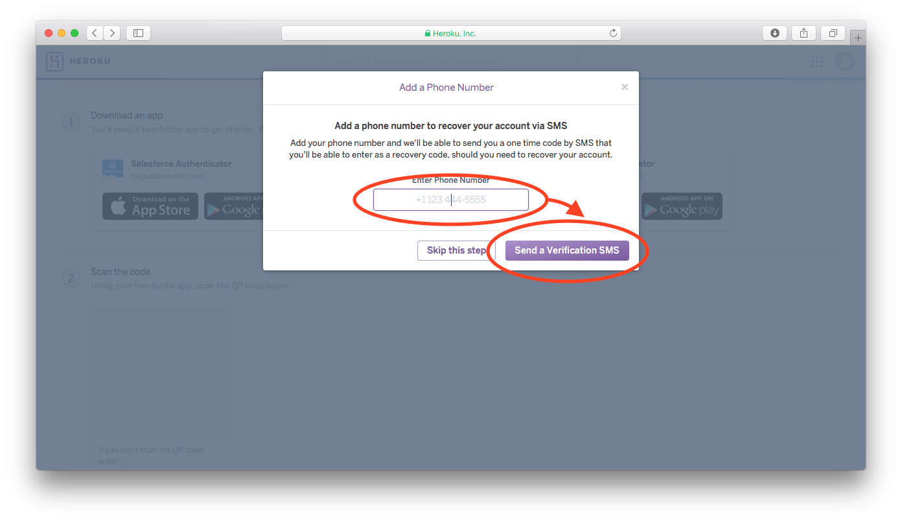

    すぐにスマートフォン宛に送られてくる6文字のコードを入力し、設定が完了します。

<a name="Heroku参考"></a><br>

#### 参考資料

1. 参考URL
    * [Heroku two-factor-authentication](https://devcenter.heroku.com/articles/two-factor-authentication)

<a name="ChiwawaAdmin"></a><br>

## 8. Chiwawa Admin

<a name="ChiwawaでAPIトークンを確認"></a><br>

#### ChiwawaでAPIトークンを確認

1. [知話輪管理画面](https://staging.chiwawa.one/admin/home)にログイン  
    ログイン時に企業IDが必要なので、あらかじめ入手しておく必要があります。

    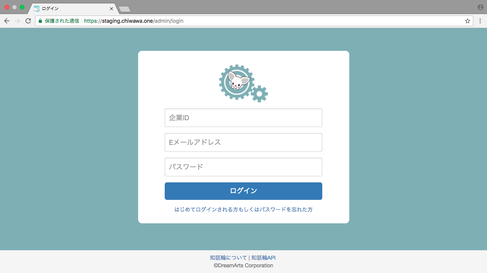

1. ログイン後、管理画面から『カスタマイズ』、『Bot管理(トークン発行)』を選択  

    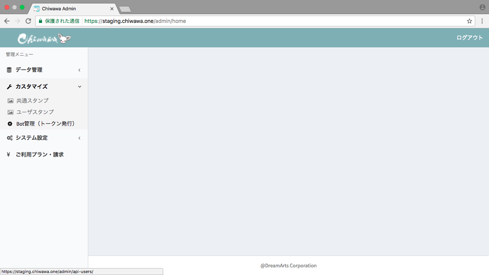


1. 『Bot一覧』から『新しく作成する』を選択  
    WebhookのURLに[heroku上にアプリケーションを作製](#some-app-name-01234567)の時に保存したURLの「[http://some-app-name-01234567.herokuapp.com/]()」を設定。

    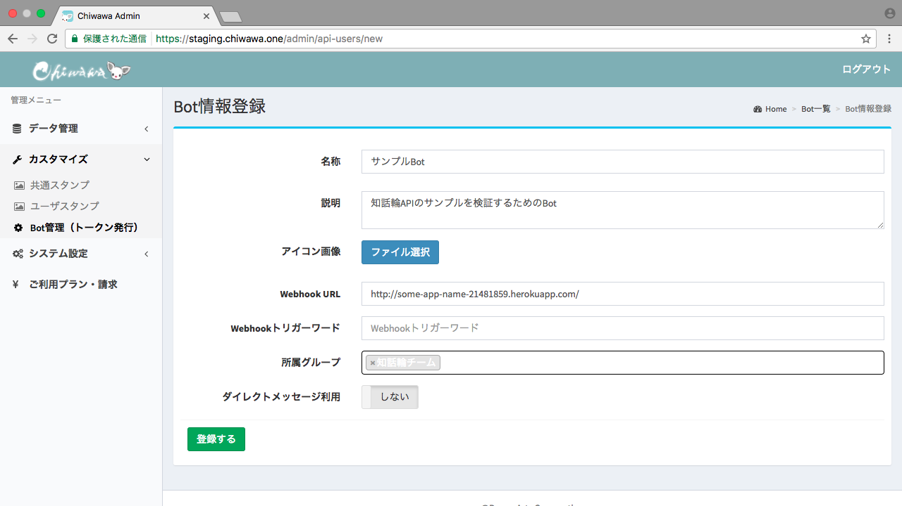

1. 登録後に出てくる画面の「APIトークン」「Webhook検証トークン」を記録しておく  
    現在は架空のトークンを例として表示しています。

    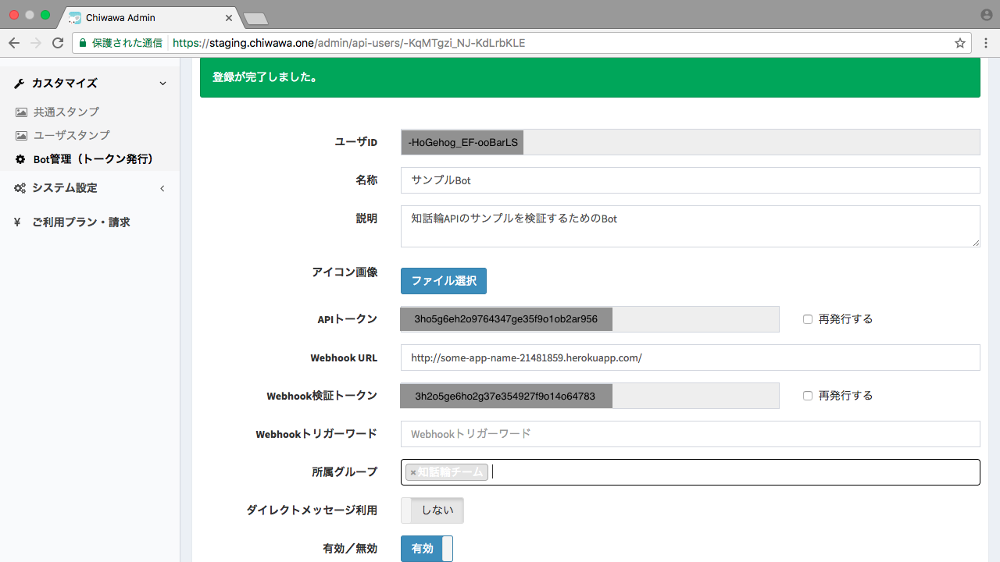

    - 3ho5g6eh ...(APIトークン)
        - 正規のBotサーバからの情報かを知話輪サーバが判断するためのAPIトークン。
        - Botサーバが知話輪サーバに必要な情報を返すとき、認証として必要なトークン情報。
    - 3h2og5ge ...(Webhook検証トークン)
        - 正規の知話輪サーバからの情報かをBotサーバが判断するためのトークン。
        - Botサーバに送られるメッセージに付くWebhookと検証Webhookを比較することで判断。

<a name="Github"></a><br>

## 9. Github

<a name="Githubの登録"></a><br>

#### Githubの登録

1. [Github 公式ホームページ](https://github.com/)からGithubアカウントの登録

    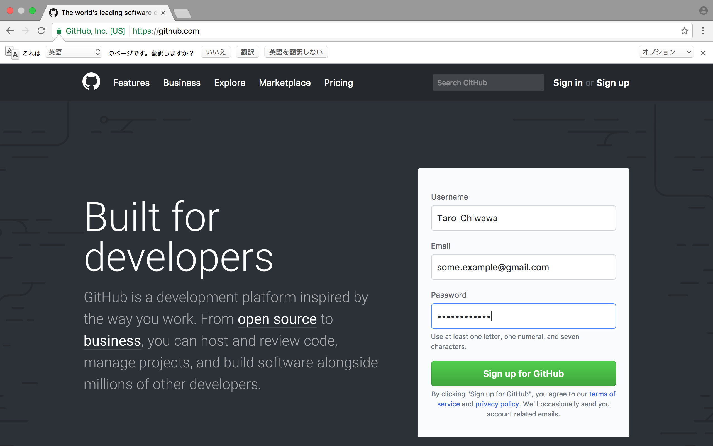

1. 設定すると『ダッシュボード』ページが表示

    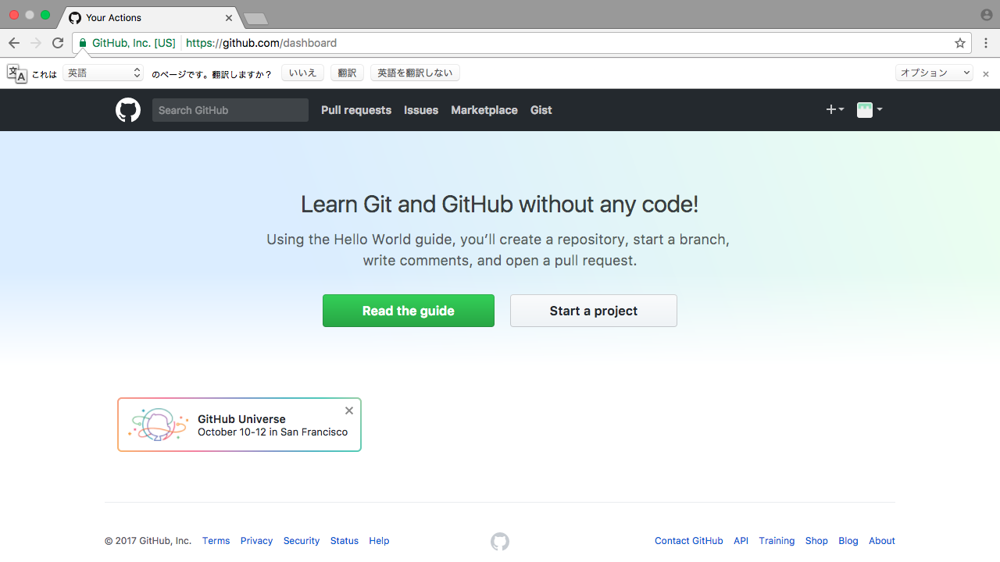

1. 『Start a project』でBotサーバのプログラムを管理する『リポジトリ』を作ることができる

<a name="Github参考"></a><br>

#### 参考資料

1. 参考URL

    * [GitHubのアカウント登録からリポジトリ操作まで](http://qiita.com/muneo/items/1321bf8cdb21178a73e2)
<br><br><br><br><br><br>
