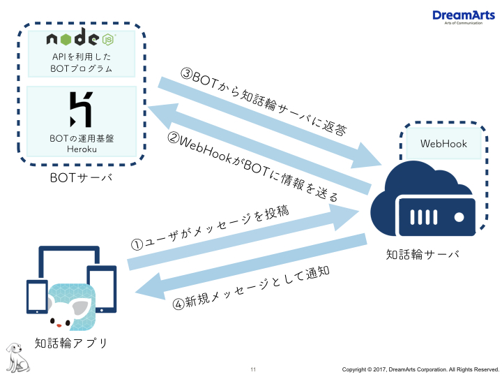

# 知話輪APIのメッセージ投稿機能を使ってecho Botを作製

<br><br>

## 初めに

1. ドキュメント概要

    - [製作に入るまで](#製作に入るまで)
      > 必要となる事前知識を取り入れ、完成のイメージをつかめるよう説明します。

      - 準備
      - 完成までの道のり
    - [実装手順](#実装手順)
      > [知話輪APIドキュメント](https://developers.chiwawa.one/api/document.html)に書かれている内容から、Botを作製する手順を示しています。

      - HTTP Responce
      - JSON解析・生成
      - HTTP Request
    - [Node.jsでの手順](#Node.jsでの手順)
      > 具体的にプログラムを実装しています。

      - 全体プログラム
      - HTTP Responce
      - JSON解析・生成
      - HTTP Request

<a name="製作に入るまで"></a>
<br><br>

## 製作に入るまで

### 準備

1. [知話輪APIドキュメント](https://developers.chiwawa.one/api/document.html)の内容を理解する

    > どのようにリクエストを処理しているのかの流れをイメージしてみましょう。

1. Botプログラムの流れを考える

    > Node.jsを使って、どのようにBotの動作を表現するか考えましょう。

<br><br>

### 完成までの道のり

1. エコーBotサーバでは、実装のイメージ図は以下のようになる

      

1. BOTサーバ内に設置するNode.jsプログラムでは、以下が必要となる

    * 知話輪サーバから送られたメッセージを受け取る。

    * メッセージの内容から返すべき情報を生成する。

    * 知話輪サーバにその情報を渡す。

<a name="実装手順"></a>
<br><br>

## 実装手順

### HTTP Responce

1. 知話輪サーバからメッセージを受け取るには、HTTP Responceが必要です

1. HTTP Responceは、情報を受け取ります

1. 知話輪APIでは、情報はJSON形式の文字列でやり取りすることになっています (文字列からJSONへの変換が必要)

<br><br>

#### 概要

##### HTTP Responceで知話輪サーバからメッセージを受け取る

1. BOTサーバは、知話輪サーバからPOSTリクエストを受け付けている (②を受け取る準備)


1. 知話輪アプリから「メッセージ」が投稿される(①)

    > 知話輪内で発生した各種イベント情報を、指定したWebhook URLへ送信します。  
    **通知はPOSTメソッド** で行われます。

1. 知話輪サーバからWebhook URL(図ではBOTサーバURL)にPOSTリクエストが送られる(②)

    > リクエスト：*イベント情報を含んだ* **JSONデータ** として送信されます。

1. BOTサーバは、知話輪`200 OK`の返事を返す(②を無事に受け取った通知)

    > レスポンス：リクエストに対しては **速やかにHTTP 200 OKを返して下さい。** リクエストが何らかの理由でエラーになったとしても再送信はされません。

1. 受け取った文字列をJSONオブジェクトに変換

<br><br>

### JSON解析・生成

知話輪サーバからのメッセージを元に必要な情報を受け渡しするには、JSON解析・生成を必要とする

<br><br>

#### 概要

##### JSON解析でメッセージの検証

1. メッセージから検証用トークンを取り出す

    Botでは、headersの中のChiwawa-Webhook-Token要素となる。  

1. Botの持つ検証用トークンと一致するかを確認する

    Botでは、予め定数に格納しています。  
    (検証用トークンは、Chiwawa Adminの「Bot管理(トークン発行)」から入手。)

    > リクエスト検証：  

    > 各通知リクエストのHTTPヘッダー (X-Chiwawa-Webhook-Token)には検証用トークンがセットされます。
    リクエストの送信元が知話輪であることを確認するために使用して下さい。
    **検証トークンは管理画面でWebhookを登録する際に発行されます。**

1. トークンが一致するとき、メッセージの送信元を知話輪サーバとみなす。

<br><br>

##### JSON解析でメッセージから要素の取り出し

1. メッセージから、知話輪サーバに渡す情報(③)の内容の生成に必要な要素を取り出す。

    echo Botでは、messageの中のtext要素となる。(下の例では、「こんにちは知話輪」)

    ```JavaScript
    text_data // => "こんにちは知話輪"
    ```

    > メッセージイベント：メッセージがグループチャットに投稿された際に通知されます。

    > リクエスト
    ```JSON
    {
      "type":"message",
      "message":{
        "messageId":"-KYNLTQGqVzhXq20kgiQ",
        "groupId":"-KWG0zzmnrdk0Im4ohiC",
        "type":"text",
        "text":"こんにちは知話輪",
        "createdAt":1479202015812,
        "createdBy":"-KWCrXk3EIWM56E180Kn",
        "createdUserName":"山田　太郎"
      }
    }
    ```

<br><br>

##### 取り出した要素から知話輪サーバに渡す情報の内容をJSONに生成

1. 取り出した要素からBotが知話輪サーバに渡す情報の内容を生成。

    echo Botでは、テキストをそのまま返すので、以下のJSONを作る。(text_dataには「こんにちは知話輪」といった上で取得した要素が入っているものとする)

    ```JSON
    {
      "text" : "text_data"
    }
    ```

    > メッセージ投稿：グループチャットにメッセージを投稿します。

    > リクエスト：`POST /groups/%2FInsuite%2Fgroup%2F2000001/messages`  
    ```JSON
    {
      "text":"こんにちは",
      "from":{
        "userId":"/Insuite/member/1000003",
        "name":"知話輪 太郎"
      },
      "to":[
        "/Insuite/member/1000001",
        "/Insuite/member/1000002",
      ],
    }
    ```

<br><br>

### HTTP Request

1. 知話輪サーバに情報を渡すには、HTTP Requestが必要です

1. HTTP Requestは、情報を送ります

1. 知話輪APIでは、情報をJSON形式の文字列でやり取りすることになっています(JSONから文字列への変換が必要)

<br><br>

#### 概要

##### JSON解析でメッセージから要素の取り出し

1. メッセージから、知話輪サーバに渡すHTTP Request(③)の生成に必要な要素を取り出す

    echo Botでは、以下の通りとなります。
    * groupId: messageの中のgrougroupId要素

    ```JavaScript
    groupId // => -KWG0zzmnrdk0Im4ohiC
    ```

1. 取り出した要素から知話輪APIドキュメントに適したHTTP RequestのURLを作成

    エコーBotでは、以下の通りとなる。
    * baseUrl: "https://${companyId}.chiwawa.one/api/public/v1"
    * submittionUrl: "${baseUrl}/groups/${groupId}/messages"
    (会社ID(companyId)は知話輪に登録するとき入手)

    ```JavaScript
    baseUrl // => https://some-company-mg22-g5w2-81hk-3ed5.chiwawa.one/api/public/v1
    submittionUrl // => `https://some-company-mg22-g5w2-81hk-3ed5.chiwawa.one/api/public/v1//groups/-KWG0zzmnrdk0Im4ohiC/messages`
    ```

    > ベースURL：APIエンドポイントの **ベースURLはhttps://{企業ID}.chiwawa.one/api/public/v1** になります。
    >> ベースURLに続けて **各APIのエンドポイントパスを付加** してください。

<br><br>

##### API認証に必要なヘッダ情報をJSONに生成

1. 取り出した要素からBotが知話輪サーバに渡す情報のヘッダの内容を生成

    Botでは、以下のJSONを作ります。(apiTokenは、Chiwawa Adminの「Bot管理(トークン発行)」から入手)

    ```JavaScript
    apiToken // => "3ho5g6eh ..."
    ```

    ```JSON
    {
      "Content-Type": "application/json",
      "X-Chiwawa-API-Token":"apiToken"
    }
    ```

    > API認証：API認証はトークンにより行われます。
    APIリクエスト時に**HTTPヘッダー(X-Chiwawa-API-Token)にAPI利用トークンをセット**します。
    **API利用トークン**は**知話輪管理画面で** API利用ユーザ（Botユーザ）を登録することで **発行** されます。

<br><br>

##### 取り出した要素から知話輪APIドキュメントに適したデータに加工

1. HTTP Requestで知話輪サーバに渡すJSONを生成する。

    echo Botでは、以下のJSONとなる。

    ```JavaScript
    submittionUrl // => `https://${companyId}.chiwawa.one/api/public/v1//groups/${groupId}/messages`
    apiToken // => 3ho5g6eh ...
    text_data // => "こんにちは知話輪"
    ```

    ```JSON
    {
      "url": "submittionUrl",
      "headers":
        {
          "Content-Type": "application/json",
          "X-Chiwawa-API-Token": "apiToken"
        },
      "json":
        {
          "text" : "text_data"
        }
    }
    ```

<br><br>

##### 知話輪サーバにJSONの情報をHTTP Request

1. 生成したJSONオブジェクトを文字列に変換

1. 文字列で表現されたJSONをHTTP METHODで送信。(③)

    エコーBotでは、「POST」でリクエストをする。

    > メッセージ投稿：グループチャットにメッセージを投稿します。

    > リクエスト：`POST /groups/%2FInsuite%2Fgroup%2F2000001/messages`

    ```JSON
    {
      "text":"こんにちは",
      "from":{
        "userId":"/Insuite/member/1000003",
        "name":"知話輪 太郎"
      },
      "to":[
        "/Insuite/member/1000001",
        "/Insuite/member/1000002",
      ],
    }
    ```

<a name="Node.jsでの手順"></a>
<br><br>

## Node.jsでの手順

### 全体プログラム

1. echo Botでのindex.jsプログラムを以下に示す。

    ```JavaScript
    const express = require("express");
    const bodyParser = require("body-parser");
    const request = require('request');

    const companyId = process.env.NODE_COMPANY_ID;
    // 知話輪API 利用トークン
    const apiToken = process.env.NODE_API_TOKEN;
    // 知話輪Webhook 検証トークン
    const verifyToken = process.env.NODE_VERIFY_TOKEN;

    const baseUrl = `https://${companyId}.chiwawa.one/api/public/v1`;

    const server = express();

    server.use(bodyParser.urlencoded({
        extended: true
    }));
    server.use(bodyParser.json());

    server.post("/", function(req, res) {
        console.log(req.body);
        res.json({ "result": "OK" });

        var reqWebhookToken = req.headers['x-chiwawa-webhook-token'];
        if (reqWebhookToken === verifyToken) {

            var text_data = req.body.message.text;
            var groupId = req.body.message.groupId;
            var submittionUrl = baseUrl + `/groups/${groupId}/messages`;

            var content = {
                'text' : text_data
            };
            var headers = {
                'Content-Type': 'application/json',
                'X-Chiwawa-API-Token':apiToken
            };
            var options = {
                url: submittionUrl,
                headers: headers,
                json: content
            }

            request.post(options, function(err,httpResponse,body){
            });
        }

    });

    server.listen( process.env["PORT"] || "3000");
    ```

1. package.json

    ```JSON
    {
      "name": "send_message",
      "version": "1.0.0",
      "description": "",
      "main": "index.js",
      "scripts": {
        "test": "echo \"Error: no test specified\" && exit 1",
        "start": "node index.js"
      },
      "author": "",
      "license": "ISC",
      "dependencies": {
        "body-parser": "^1.17.2",
        "express": "^4.15.3",
        "request": "^2.81.0"
      }
    }
    ```

<br><br>

### ネットワークにプログラムを公開する時の注意点

#### APIを環境変数として規定

APIトークンは、プログラムの中の直接書くべきではありません。なぜなら、知話輪サーバがAPIトークンで
認証を行なっているからです。(似た例では、パスワードをファイルに保存して、公開している状態みたいなもの)

1. Herokuにログイン

1. 作製したアプリを押下。(今回は、『some-app-name-01234567』)

1. 『Setting』をクリック。(今回は、歯車のアイコン。これは、アプリの名前の変更や、削除を行うためなどの用途)

    [Heroku アプリ設定](https://dashboard.heroku.com/apps/some-app-name-01234567/settings)

1. 『Config Variables』にある『Reveal Config Vars』をクリック。

1. 『Config Vars』の『KEY』と『VALUE』に以下を追加。

    ```
    NODE_API_TOKEN (API Token)
    NODE_COMPANY_ID (企業ID)
    NODE_VERIFY_TOKEN (Webhook検証トークン)
    ```

    ```
    NODE_API_TOKEN : 3ho5g6eh ...
    NODE_COMPANY_ID :  staging-m3j19gn- ...
    NODE_VERIFY_TOKEN : 3h2og5ge ...
    ```

1. 『index.js』では、`process.env.NODE_API_TOKEN`のように『process.env.XXX_XXX』で呼び出すことができる。

<br><br>


### HTTP Responce

#### プログラム

##### HTTP Responceで知話輪サーバからメッセージを受け取る

1. Botサーバは、知話輪サーバから、POSTリクエストを受け付ける。(②を受け取る準備)

    「express」ライブラリがリクエストの処理を受け付ける。

    ```JavaScript
    const express = require("express");
    const bodyParser = require("body-parser");

    const server = express();

    server.post("/", function(req, res) {

    });

    server.listen( process.env["PORT"] || "3000");
    ```

1. 知話輪アプリから「メッセージ」が投稿される(①)

    アプリから、「こんにちは知話輪」とグループに任意の文字を投稿する。

1. 知話輪サーバからWebhook URL(今回は、BotサーバURL)にPOSTリクエストが送られる(②)

    知話輪Adminで設定すると、知話輪サーバが送信します。

    ```JavaScript
    server.post("/", function(req, res) {
        console.log(req.body); // =>
        /*
        {
          "type":"message",
          "message":{
            "messageId":"-KYNLTQGqVzhXq20kgiQ",
            "groupId":"-KWG0zzmnrdk0Im4ohiC",
            "type":"text",
            "text":"こんにちは知話輪",
            "createdAt":1479202015812,
            "createdBy":"-KWCrXk3EIWM56E180Kn",
            "createdUserName":"山田　太郎"
          }
        }
        */
    });
    ```

1. Botサーバは、知話輪「200 OK」の返事を返す(②を受け取った返事)

    resにJSON形式の返事を生成します。

    ```JavaScript
    server.post("/", function(req, res) {
        res.json({ "result" : "OK" });
    });
    ```

1. 受け取った文字列をJSONオブジェクトに変換

    `bodyParser`ライブラリが変換しています。

    ```JavaScript
    server.use(bodyParser.urlencoded({
        extended: true
    }));
    server.use(bodyParser.json());
    ```

<br><br>

### JSON解析・生成

#### プログラム

##### JSON解析でメッセージの検証

1. メッセージから検証用トークンを取り出す

    ```JavaScript
    var reqWebhookToken = req.headers['x-chiwawa-webhook-token'];
    ```

1. Botの持つ検証用トークンと一致するかを確認する

    ```JavaScript
    if (reqWebhookToken === verifyToken) {

    }
    ```

1. トークンが一致するとき、メッセージの送信元を知話輪サーバとみなす  
    条件が真のとき、ポストレスポンス元を知話輪サーバとみなしています。

    ```JavaScript
    if (reqWebhookToken === verifyToken) {
        // このレスポンスは知話輪サーバからだ、と判断
    }
    ```

<br><br>

##### JSON解析でメッセージから要素の取り出し

1. メッセージから、知話輪サーバに渡す情報(③)の内容の生成に必要な要素を取り出す

    ```JavaScript
    var text = req.body.message.text;
    ```

<br><br>

##### 取り出した要素から知話輪サーバに渡す情報の内容をJSONに生成

1. 取り出した要素からBotが知話輪サーバに渡す情報の内容を生成。

    ```JavaScript
    var content = {
        'text' : text_data
    }
    ```

<br><br>

### HTTP Request

#### プログラム

##### JSON解析でメッセージから要素の取り出し

1. メッセージから、知話輪サーバに渡すHTTP Request(③)の生成に必要な要素を取り出す。

    ```JavaScript
    var groupId = req.body.message.groupId;
    ```

1. 取り出した要素から、知話輪APIドキュメントに適したHTTP RequestのURLを作成

    ```JavaScript
    const baseUrl = `https://${companyId}.chiwawa.one/api/public/v1`;
    var submittionUrl = baseUrl + `/groups/${groupId}/messages`;
    ```

<br><br>

##### API認証に必要なヘッダ情報をJSONに生成

1. 取り出した要素からBotが知話輪サーバに渡す情報のヘッダの内容を生成

    ```JavaScript
    const apiToken = "3ho5g6ehvnkeahvdlskajfoiiov2903g";
    var headers = {
        'Content-Type': 'application/json',
        'X-Chiwawa-API-Token':apiToken
    };
    ```

<br><br>

##### 取り出した要素から知話輪APIドキュメントに適したデータに加工

1. HTTP Requestで知話輪サーバに渡すJSONを生成する

    ```JavaScript
    var options = {
        url: submittionUrl,
        headers: headers,
        json: content
    }
    ```

<br><br>

##### 知話輪サーバにJSONの情報をHTTP Request

1. 生成したJSONオブジェクトを文字列に変換

    `request`ライブラリが変換します。

    ```JavaScript
    request.post(options, function(err, httpResponse, body){
        console.log({"responce": "can't send responce"});
    });
    ```

1. 文字列で表現されたJSONをHTTP METHODで送信。(③)

    echo Botでは、「POST」でリクエストする。「request」のpostメソッドで送信。

    ```JavaScript
    request.post(options, function(err, httpResponse, body){
        console.log({"responce": "can't send responce"});
    });
    ```

<br><br>
<br><br>
<br><br>
